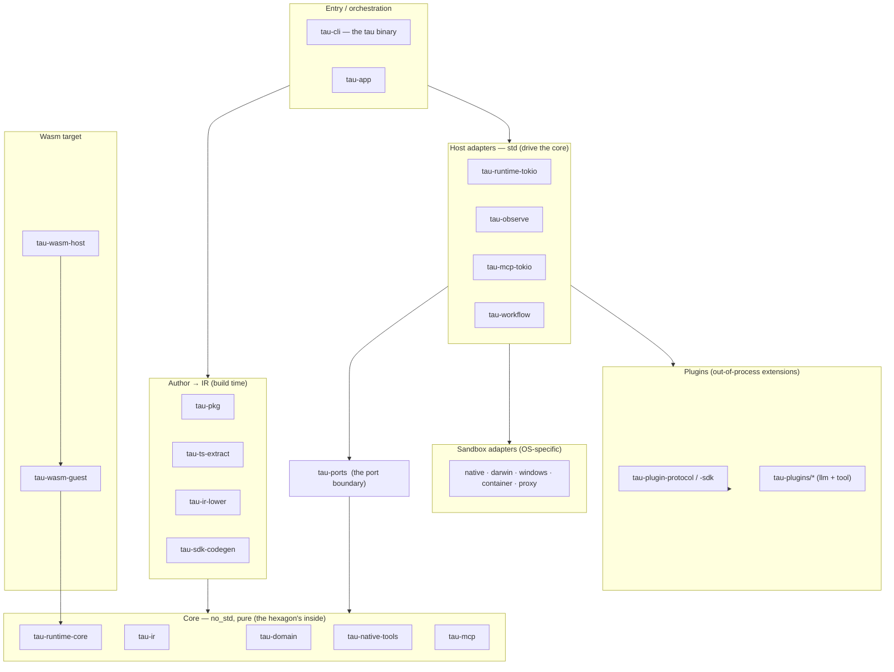

# ARCHITECTURE

The coarse code-map of tau: *where does the thing that does X live, and how do
the pieces relate?* Read this first, then dive into the crate the map points at.

> **What kind of document this is.** This is the **stable spine** of tau's
> [living-documentation system](docs/superpowers/implementation-trees/) —
> deliberately coarse. It follows the
> [ARCHITECTURE.md convention](https://matklad.github.io/2021/02/06/ARCHITECTURE.md.html):
> it names modules and boundaries that rarely change and **does not track
> fine-grained detail**. Revisit it a few times a year, not every PR.
>
> The *living*, per-PR detail lives in the layers built to churn:
> **why** a decision was made → ADRs in [`docs/decisions/`](docs/decisions/);
> **what's next** → the roadmap in [`docs/superpowers/plans/`](docs/superpowers/plans/);
> **what shipped + discoveries** → per-EPIC trees in
> [`docs/superpowers/implementation-trees/`](docs/superpowers/implementation-trees/);
> **how to build/run** → [`CLAUDE.md`](CLAUDE.md) and the Diátaxis docs under
> [`docs/`](docs/).
>
> **This map can't silently rot:** the crate list below is enforced by a test
> (`xtask/tests/architecture_md.rs`) that fails CI if a `crates/<name>` crate is
> added without being named here.

## What tau is (bird's-eye)

tau is a **workflow compiler + engine** for governed agentic workflows. You
author a project (`tau.toml`, or TypeScript / Python that lowers to the same
config), and `tau build` compiles it to a **typed intermediate representation**
(the IR). That IR is then either interpreted on a host, or compiled into a
**self-contained WASI 0.2 wasm component**. Capabilities are **governed at build
time** (a root `[allow]` block; ungoverned builds are refused) and enforced
again at runtime by OS sandboxes and the wasm component boundary.

Two contracts anchor everything: the **IR** (author-facing, frozen JSON schema)
and the **plugin/port protocol** (extension-facing). See ADR-0055/0056/0057 in
[`docs/decisions/`](docs/decisions/).

## The 10,000-ft view (hexagonal; dependencies point inward)

Everything depends **inward** toward `tau-domain` / `tau-ir` / `tau-ports`. The
core is `no_std + alloc` so it compiles unchanged into the wasm guest; the std
host shells and OS sandboxes are adapters behind `tau-ports`.

## Code map (by layer)

### Core — `no_std + alloc`, pure, wasm-buildable
| Crate | Owns | Entry |
|---|---|---|
| `tau-domain` | Core domain types (messages, agents, packages, plugin descriptors); pure data, no I/O | `crates/tau-domain/src/lib.rs` |
| `tau-ir` | The workflow IR — typed representation lowered from `tau.toml` | `crates/tau-ir/src/lib.rs` |
| `tau-runtime-core` | Executor-agnostic kernel; drives the agent loop | `crates/tau-runtime-core/src/lib.rs` |
| `tau-native-tools` | Deterministic native tool bodies shared by the dev profile and the wasm guest | `crates/tau-native-tools/src/lib.rs` |
| `tau-mcp` | MCP (Model Context Protocol) facilitator types + contract layer (JSON-RPC, cassettes) | `crates/tau-mcp/src/lib.rs` |

### Ports — the hexagonal boundary
| Crate | Owns | Entry |
|---|---|---|
| `tau-ports` | Port (trait) definitions host adapters implement; also the `target` registry | `crates/tau-ports/src/lib.rs` |

### Author → IR (build time)
| Crate | Owns | Entry |
|---|---|---|
| `tau-pkg` | Package manager: resolve / install / verify extension packages; project loading | `crates/tau-pkg/src/lib.rs` |
| `tau-ir-lower` | Std-side lowering `ProjectConfig` → `IrModule` (kept out of the no_std `tau-ir`) | `crates/tau-ir-lower/src/lib.rs` |
| `tau-ts-extract` | TypeScript source → `ProjectConfig` via swc static analysis | `crates/tau-ts-extract/src/lib.rs` |
| `tau-sdk-codegen` | Codegen for authoring SDKs (`@tau/sdk`, Python) + the `@tau/embed-js` consumer scaffold, from the frozen IR schema | `crates/tau-sdk-codegen/src/lib.rs` |
| `tau-embed-example` | EPIC 7.1 Variant B reference host: a product-shaped binary that links `tau-runtime-core` via the `embed` prelude, implements the ports, and drives a baked workflow | `crates/tau-embed-example/src/main.rs` |

### Host runtime — std adapters
| Crate | Owns | Entry |
|---|---|---|
| `tau-runtime-tokio` | Tokio host shell: process-gate adapters, plugin host, persistence, Clock/Random; the library embedding API | `crates/tau-runtime-tokio/src/lib.rs` |
| `tau-app` | Application orchestration; wires ports to adapters | `crates/tau-app/src/lib.rs` |
| `tau-observe` | Observability primitives (structured logging, tracing) | `crates/tau-observe/src/lib.rs` |
| `tau-mcp-tokio` | Tokio runtime + transports (stdio, Streamable HTTP) for `tau-mcp`; `McpBridge` | `crates/tau-mcp-tokio/src/lib.rs` |
| `tau-workflow` | Linear pipeline runner for agentic workflows | `crates/tau-workflow/src/lib.rs` |

### Sandbox adapters — OS-specific capability enforcement
| Crate | Owns | Entry |
|---|---|---|
| `tau-sandbox-native` | Linux (landlock + seccomp + namespaces) | `crates/tau-sandbox-native/src/lib.rs` |
| `tau-sandbox-darwin` | macOS (`sandbox-exec` / SBPL) | `crates/tau-sandbox-darwin/src/lib.rs` |
| `tau-sandbox-windows` | Windows AppContainer | `crates/tau-sandbox-windows/src/lib.rs` |
| `tau-sandbox-container` | Container (docker/podman shell-out) | `crates/tau-sandbox-container/src/lib.rs` |
| `tau-sandbox-proxy` | Userspace HTTP-CONNECT egress proxy for sandboxed plugins | `crates/tau-sandbox-proxy/src/lib.rs` |

### Wasm target
| Crate | Owns | Entry |
|---|---|---|
| `tau-wasm-guest` | WASI 0.2 component guest driving the IR via `tau-runtime-core`; `wasm32-wasip2` only | `crates/tau-wasm-guest/src/lib.rs` |
| `tau-wasm-host` | Std `wasmtime` embedder that loads the guest and satisfies its host imports | `crates/tau-wasm-host/src/lib.rs` |

### Plugins — out-of-process extensions
| Crate | Owns | Entry |
|---|---|---|
| `tau-plugin-protocol` | Wire-format + framing (MessagePack-RPC over stdio) | `crates/tau-plugin-protocol/src/lib.rs` |
| `tau-plugin-sdk` | Plugin author SDK (per-port runners over the protocol) | `crates/tau-plugin-sdk/src/lib.rs` |
| `tau-plugin-test-support` | Cassette replayer + helpers for LLM-backend plugins | `crates/tau-plugin-test-support/src/lib.rs` |
| `tau-plugin-conformance` | Parameterized conformance suite for `LlmBackend` plugins | `crates/tau-plugin-conformance/src/lib.rs` |
| `tau-plugin-compat` | Compatibility harness — layer-3/4 tests for the shipped plugins | `crates/tau-plugin-compat/src/lib.rs` |
| `tau-plugins/*` | The shipped plugins: `anthropic` / `openai` / `ollama` (LLM backends), `echo-llm` / `echo-tool` (test doubles), `fs-read` / `fs-write` / `shell` (tools) | `crates/tau-plugins/<name>/` |

### Entry point & tooling
| Crate | Owns | Entry |
|---|---|---|
| `tau-cli` | The `tau` binary internals (`build`, `run`, `verify`, `check`, `embed`, `dev`, …) | `crates/tau-cli/src/main.rs` |
| `tau-trace` | Pure, headless render model for execution traces — `TraceEvent` stream → `TraceModel` (span tree + time-axis); backs `tau run --tui` and `tau trace` | `crates/tau-trace/src/lib.rs` |
| `tau-conformance` | Cross-profile (dev vs wasm) conformance gate for the canonical fan-monitor scenario | `crates/tau-conformance/` |
| `tau-ir-conformance` | Cross-mode conformance fixtures + runner for the IR | `crates/tau-ir-conformance/` |
| `landlock-exec-repro` | Minimal repro for the per-command exec-gating sub-project (kept for regression context) | `crates/landlock-exec-repro/` |

`xtask/` (not under `crates/`) is the workspace task-runner and hosts this map's
freshness test.

## Boundaries & invariants (don't break without a deliberate change)

- **Dependencies point inward.** Adapters (host shells, sandboxes, plugins,
  wasm host) depend on the core and `tau-ports`; the core depends on neither.
- **The core is `no_std + alloc`.** `tau-domain`, `tau-ir`, `tau-runtime-core`,
  `tau-native-tools`, `tau-mcp` must stay wasm-buildable — that's what lets
  `tau-wasm-guest` compile the same kernel into a component. Std-only work
  (lowering, I/O, tokio) goes in a separate crate (e.g. `tau-ir-lower`).
- **Two frozen contracts.** The IR JSON schema (`schemas/ir/`, `schemas/run-event/`)
  and the plugin/port protocol are versioned and drift-tested; changing them is
  an ADR-worthy event.
- **Governed by default.** A build with no root `[allow]` block is refused;
  capabilities flow allow → IR → sandbox/WIT world. See ADR-0055/0057/0059.

## Where to go next

- **Why** something is the way it is → [`docs/decisions/`](docs/decisions/) (ADRs).
- **What's planned** → [`docs/superpowers/plans/`](docs/superpowers/plans/).
- **What shipped, in detail** → [`docs/superpowers/implementation-trees/`](docs/superpowers/implementation-trees/) (living per-area trees).
- **How to build / run / test** → [`CLAUDE.md`](CLAUDE.md), [`docs/dev-environment.md`](docs/dev-environment.md), and the Diátaxis docs in [`docs/`](docs/).
