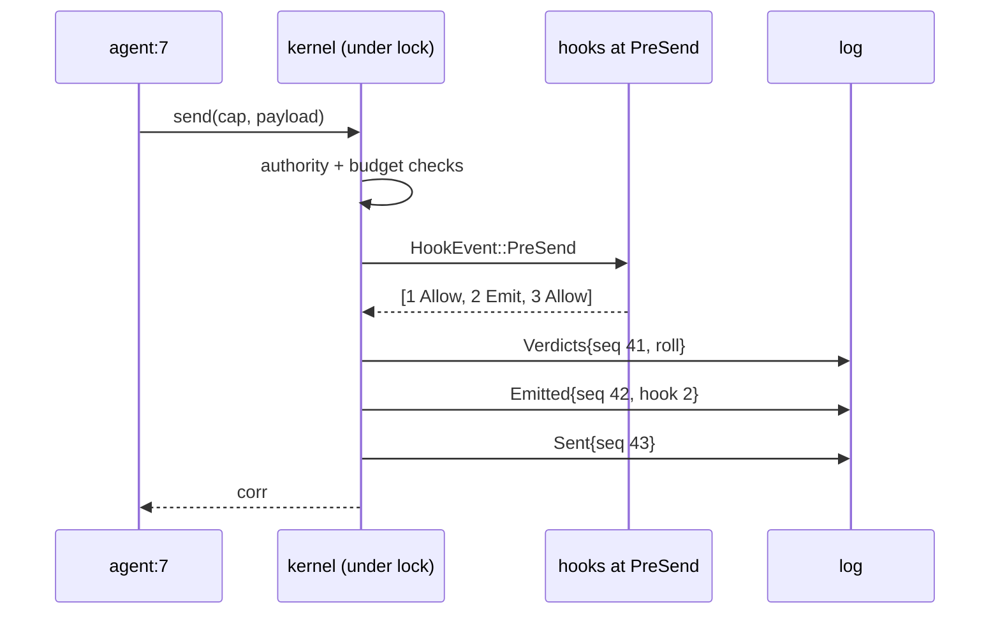

# ADR-0008: Hooks and the `attach` syscall — five points, three verdicts, two program tiers

**Status:** Accepted
**Date:** 2026-09-15
**Deciders:** tau core
**Amends:** [ADR-0002](0002-seven-syscalls.md) (the `attach` bullet),
[ADR-0004](0004-abi-freeze.md) (`ABI` 0 → 1)

## Context

M2 is "hooks (native + Rule), sandbox driver v0, replay CLI" (HANDOFF §6).
`attach` is the one syscall the kernel does not implement; `syscall.rs` says
"attach is M2 and harness-privileged" and stops there. HANDOFF §3.3 describes
hooks in one paragraph: a registry filled at boot, a synchronous metered loop
at pinned points, three verdicts, every verdict logged, first `Deny` wins,
`FailureMode::Closed` mandatory where a hook can veto. That paragraph is right
and not enough to build from. This ADR is the contract the M2a lanes implement.

Some of it already exists, and the shape below follows from what does:

- **`HookId` is frozen.** It is in `kernel/src/abi/ids.rs` since M0, and
  ADR-0005 names it as "the next instance" of the allocator shape: counter in
  state, value in the entry, equality on replay.
- **`MsgKind::Notice` already lists "a hook `Emit`"** among its producers, and
  ADR-0006 §4 already reserves the `denied` tool result for "a hook `Deny`
  once M2 lands". The verdicts have a place to land on both sides of the
  kernel.
- **`Entry` is not ABI yet.** `log.rs` says it "may churn until the replay CLI
  lands (M2), at which point it joins the frozen surface". New entry kinds are
  free today and permanent soon; this lane goes first.
- **`Endpoint` is ABI**, `#[non_exhaustive]`, and has three variants. A hook
  that emits a notice is a fourth sender.

Four constraints shape the answer:

- **The fold is pure and hook programs are not.** A native hook is an
  arbitrary Rust closure. It cannot be part of `apply`, or a log would refold
  only on the binary that wrote it. So the log must record what hooks
  *decided*, and replay must apply that record without asking them again. The
  precedent is `Resolved` (ADR-0002, "Selectors"): the filter is not logged,
  only the outcome.
- **The kernel never parses payloads** (ADR-0003, invariant 2). This ADR
  states the invariant precisely rather than as a slogan: the kernel's
  *routing and accounting* never depend on payload content. An installed
  program may observe content, the way an eBPF program observes a packet the
  kernel does not interpret, and every content-based verdict is a log entry.
- **The harness is not an agent** (HANDOFF §4.3). `attach` is its privilege.
  Structurally, not by a permission bit: the method lives on the type only the
  harness holds.
- **Nothing reserved and inert.** ADR-0001 names a wasm/native parity gate
  that never executed as the sharpest example of v1's failure. HANDOFF §3.3
  "reserves a WASM+fuel slot". This ADR does not. Two tiers exist; a third is
  an ADR on the day a policy author who is not the harness author exists.

## Decision

### 1. Five hook points, typed by the verdicts they admit

A hook point is a pinned moment in the kernel where installed programs are
consulted. There are five, from HANDOFF §3.3, and the split that matters is
between the *pre* points, where the kernel has not yet committed the entry and
a hook may stop it, and the *on* points, where the entry is already applied
and a hook may only observe.

| Point | Fires when | Subject | Admits |
|---|---|---|---|
| `PreSend` | an agent's request has passed the authority and budget checks and is about to be logged as `Sent` | the sender | `Allow`, `Deny`, `Emit` |
| `PreDeliver` | a driver's reply or partial is about to be logged as `Replied` and enter its owner's mailbox | the owner | `Allow`, `Deny`, `Emit` |
| `OnSpawn` | a `spawn` has passed the subset and carve checks and is about to be logged as `Spawned`; the root included | the child | `Allow`, `Deny`, `Emit` |
| `OnExit` | an agent has finished — `Exited` applied, or aborted by the `Tick` that reached its deadline or emptied its `wall_ms` | the finished agent | `Allow`, `Emit` |
| `OnBudget { dim, below }` | applying an entry moved the subject's remaining grant on `dim` from at or above `below` to under it | the agent whose grant crossed | `Allow`, `Emit` |

Two rules follow from the table:

- **`Deny` is admitted only where something can be stopped.** An exit or a
  budget crossing has already happened; a `Deny` there would be a silent
  no-op, and silent no-ops are the v1 disease. A `Deny` from a hook at an
  *on* point is a program failure (§4), not a fourth outcome.
- **`OnBudget` is edge-triggered and absolute.** It fires once per crossing,
  on whichever entry caused it: a `Sent` (the reservation), a `Replied` (the
  settle), a `Tick` (the wall charge). A grant that rises back above the line
  — a child returned unspent budget — and crosses again fires again. The
  threshold is an absolute remaining amount because integer division is denied
  workspace-wide; a harness that thinks in percentages computes the amount
  once, at `attach`.

Kernel-originated notices — the `CancelNotice` a `Cancelled` entry delivers,
the notice an `Emit` produces — are **not** subject to `PreDeliver`. They are
consequences of entries that were already governed, and a `Deny` on a cancel
notice could not un-freeze the subtree the same entry froze. `PreDeliver` is
driver traffic: what the world says back to an agent.

### 2. What a hook sees: one event, plain data

Every hook at a point receives the same event, whatever tier it belongs to.
The event is plain data — no references into kernel state, no handles,
serializable — because that is what makes it loggable in tests and what any
future out-of-process tier would need. It is a Rust type, versioned with the
crate like the selectors (ADR-0002); it never reaches the wire, so it is not
ABI.

```rust
// kernel/src/hook.rs
pub enum HookEvent {
    PreSend    { seq: Seq, subject: AgentId, parent: Option<AgentId>, depth: u64,
                 driver: DriverId, corr: Corr, payload: Vec<u8>, remaining: Budget },
    PreDeliver { seq: Seq, subject: AgentId, parent: Option<AgentId>, depth: u64,
                 driver: DriverId, corr: Corr, kind: MsgKind, payload: Vec<u8>, remaining: Budget },
    OnSpawn    { seq: Seq, subject: AgentId, parent: Option<AgentId>, depth: u64,
                 ns: Namespace, remaining: Budget },
    OnExit     { seq: Seq, subject: AgentId, parent: Option<AgentId>, depth: u64,
                 outcome: Outcome, result: Option<Vec<u8>>, unspent: Budget },
    OnBudget   { seq: Seq, subject: AgentId, parent: Option<AgentId>, depth: u64,
                 dim: DimKey, below: u64, remaining: Budget },
}
```

`seq` is the position the governed entry will take (pre points) or took (on
points). `remaining` is the subject's grant before the reservation or settle
the event is about. `payload` is the bytes, opaque: the kernel copies them
into the event and never looks inside. For an aborted agent `result` is
`None`, because there was none.

The event carries facts the reducer already holds and bytes that are already
in memory at that moment. Building it does no I/O and no allocation the send
path was not already doing.

### 3. Three verdicts, one roll call per moment, and what the fold does with it

A hook answers with one of three verdicts, unchanged from HANDOFF §3.3:

| Verdict | Meaning | The kernel does |
|---|---|---|
| `Allow` | no objection | nothing |
| `Deny(reason)` | stop it | at a pre point: the governed entry is never written; the syscall returns `KernelError::Denied { hook, reason }` |
| `Emit { to, payload }` | let it through, and leave a note | a `Notice` from `Endpoint::Hook { id }` is delivered to `to`'s mailbox |

At a point with at least one hook attached, the kernel consults them **in
`HookId` order** — install order, since ids are allocated at `attach` — under
the same lock as the syscall, and **stops at the first `Deny`**. Hooks after
the `Deny` are not consulted and do not appear in the record. Every `Emit`
before the `Deny` is still delivered: verdicts are independent, and a hook
that wanted its note sent regardless of a later veto gets exactly that.

The record is **one `Verdicts` entry per moment**, carrying the roll call:

```json
{"entry":"verdicts","seq":41,"point":"pre_send","subject":7,
 "roll":[[1,"allow"],[2,{"deny":"9f3c…"}]]}
```

The reason is a `BlobRef`, like a `Cancelled` reason: payloads stay out of the
log. Line 41 says hook 1 allowed, hook 2 denied, hook 3 was never asked. There
is no line 42 `sent`, and agent 7's syscall returned `Denied`.

A notice an `Emit` produces is **its own entry**, because a notice is a
message and every message in the log has its own position — `Msg::seq` is
"this message's position in the log", and two notices sharing one `seq` in
one mailbox would make a `Resolved { matched }` ambiguous on replay:

```json
{"entry":"verdicts","seq":88,"point":"on_budget","subject":7,
 "roll":[[3,{"emit":{"to":7,"payload":"4a71…"}}]]}
{"entry":"emitted","seq":89,"hook":3,"to":7,"msg":{"abi":1,"seq":89,"from":{"kind":"hook","id":3},"corr":null,"kind":"notice","consumed":null,"payload":"4a71…"}}
```

Ordering is fixed by which side of the governed entry the moment sits on:



- **Pre points**: `Verdicts`, then any `Emitted`, then the governed entry if
  allowed. A log that ends between them is still truthful: the hooks were
  asked, the send never happened.
- **On points**: the entry that caused the moment, then `Verdicts`, then any
  `Emitted`. An abort is not an entry but a consequence of applying a `Tick`
  (log.rs), so `OnExit` for an abort follows the `Tick`.
- **A point with no hook attached writes nothing.** The `Attached` entries
  sit at the head of the log (§4), so a reader never has to guess whether
  silence means "all allowed" or "nobody was asked".

**The fold applies the record and never runs a program.** `apply` on a
`Verdicts` entry confirms the roll call — every hook named is attached at that
point, they appear in `HookId` order, nothing follows a `Deny` — and then does
nothing else, because the effect of a `Deny` is the absence of the next entry,
and the effect of an `Emit` is the `Emitted` entry that follows. `apply` on an
`Emitted` entry pushes the notice into `to`'s mailbox if `to` is live and
drops it otherwise, exactly as a reply to an exited owner dead-letters today.
A roll call that names a hook not attached at that point, or out of order, or
with a verdict after a `Deny`, is a `Refusal`: the log is not one this
reducer could have produced.

This is the property the rest of the design rests on, and it is stated as an
obligation in Consequences: **a log whose `Attached` entries name a native
hook this binary does not have refolds to the same state hash.**

### 4. `attach`: harness-only, boot-only, one entry

```rust
// kernel/src/kernel.rs — on Kernel, next to register_driver. Not on Handle.
pub fn attach(
    self: &Arc<Self>,
    point: HookPoint,
    program: HookProgram,
    failure: FailureMode,
) -> Result<HookId, KernelError>
```

The signature is ADR-0002's, unchanged. Who may call it is settled by where
it lives: `Handle`, the agent's whole world, has no `attach`, so an agent
cannot express the call. No permission bit, nothing to check at runtime, and
the irreducibility test is satisfied in the only direction that matters — no
program over the other six can install a hook.

**The registry is filled at boot.** `attach` after the root agent exists is
refused with the same `Refusal::AfterBoot` that drivers use. There is no
`detach`: a boot-only registry has nothing to remove, and a policy that can
change mid-run is a moving target every "was this allowed" question would
have to chase. HANDOFF §4.3's "attach/detach privilege" is superseded by
§3.3's "registry filled at boot"; a live `detach` is an amendment for the day
a long-running harness needs it (M4).

**`FailureMode` is `Open` or `Closed`**, and says what a verdict a hook
*failed to produce* counts as: `Open` → `Allow`, `Closed` → `Deny`. A native
hook fails by returning `Err`; a `Rule` cannot fail at runtime (§5). At a pre
point `Open` is refused at `attach` — `Refusal::OpenAtVetoPoint` — because
"if my guard breaks, let everything through" is not a policy anyone writes on
purpose. At an on point the mode is recorded and does not matter: the run
continues either way. A hook that *panics* is not caught: `panic` is denied
by lint in this repository, and a harness hook that panics inside the kernel
lock faults the kernel, which is `Closed` in the extreme and the correct
outcome for a policy that cannot even return.

The failure is part of the roll call, so it is never silent:

```json
{"entry":"verdicts","seq":41,"point":"pre_send","subject":7,
 "roll":[[1,"allow"],[2,{"failed":{"mode":"closed","error":"c0de…"}}]]}
```

**One entry per `attach`**, before any agent exists:

```json
{"entry":"attached","seq":2,"hook":1,"point":"pre_send","failure":"closed",
 "program":{"native":"no-shell-below-depth-2"}}
{"entry":"attached","seq":3,"hook":2,"point":{"on_budget":{"dim":"tokens","below":1000}},"failure":"open",
 "program":{"rule":"when on_budget(tokens, 1000) then emit \"tokens low\""}}
```

A native program is recorded by name — a `Name`, so it obeys the one validated
grammar — and a `Rule` by its full source, so a log is self-describing for
rules and at least attributable for natives. `HookId` is allocated the
ADR-0005 way: counter in state, value in the entry, equality on replay. State
gains `hooks: BTreeMap<HookId, HookRecord>` as a canonical field, which moves
the determinism corpus pins once (see Consequences). The live closures sit in
`Inner`, beside `drivers`, and are cache, not state.

### 5. Two program tiers, and what the Rule language can and cannot say

```rust
pub enum HookProgram {
    /// Trusted harness code. Synchronous, unmetered, sees the whole event.
    Native { name: Name, run: Arc<dyn Fn(&HookEvent) -> Result<Verdict, HookFailure> + Send + Sync> },
    /// Declarative, total, stateless, linear. Parsed at `attach`.
    Rule(Rule),
}
```

**Native** is the harness author's own code and is trusted the way the
harness is trusted: it booted the kernel and holds its handle. It runs
synchronously under the kernel lock and is not metered in v1. The rules of
conduct are HANDOFF §3.3's — no I/O, no inference — plus what the lock
implies: no `await`, no lock of its own, no panic. These are enforced by
review and by CONTRIBUTING's sorting rule, not by lint, because a closure can
call anything; a native hook that deserializes a payload and walks it is doing
driver work in the wrong place, and the review question is "which driver
should own this".

**Rule** is for the policy that should not need a recompile. It is bounded by
construction, which is the only metering a text program gets before a fuel
tier exists. A rule is one line:

```
when <point> [ if <predicate> ] then <verdict>

point     := pre_send | pre_deliver | on_spawn | on_exit | on_budget ( <dim> , <int> )
predicate := <or>
or        := <and> { or <and> }
and       := <not> { and <not> }
not       := [ not ] <atom>
atom      := ( <predicate> )
           | <fact> <cmp> <value>
           | <fact> in { <value> { , <value> } }
           | payload contains <string>
           | payload starts_with <string>
fact      := depth | driver | kind | payload.len | remaining.<dim>
cmp       := == | != | < | <= | > | >=
verdict   := allow | deny <string> | emit [ to subject | to parent ] <string>
```

Facts are the fields of the `HookEvent` for that point, by the same name;
`driver` compares against a `DriverId`, `kind` against a `MsgKind`, the rest
against integers. A rule that names a fact its point does not carry —
`driver` at `on_exit`, `payload` at `on_spawn` — is refused at `attach`, so a
rule can never fail at runtime, which is why `FailureMode` is moot for it.
`emit` without a target goes to the subject. Evaluation is one pass over the
predicate plus one linear scan of the payload per `contains` or `starts_with`;
there is no backtracking, no loop, no recursion, no allocation.

```
when pre_send if driver == shell and depth < 2 then deny "shell needs depth 2"
when pre_send if payload.len > 1048576 then deny "over 1 MiB"
when pre_deliver if driver == shell and payload contains "Permission denied" then emit to parent "child hit a permission wall"
when on_budget(tokens, 1000) then emit "tokens low"
when on_spawn if depth > 6 then deny "tree too deep"
```

What a `Rule` **cannot** say, on purpose, and where each goes instead:

| Not expressible | Why | Home |
|---|---|---|
| a JSON field of the payload (`args.cmd == "sudo"`) | the kernel would be parsing payloads by proxy | the driver that owns that schema |
| a regex over the payload | backtracking is not linear; a linear engine is a dependency this tier does not need yet | a native hook |
| anything across events — counts, rates, "the third time" | rules are stateless; state that is not in the log is not replayable | a native hook, which may hold state, since only its verdicts are logged |
| anything about another agent | the event is about one subject | a native hook, or a driver |
| arithmetic, time, string transforms | not a predicate | a native hook |
| rewriting the payload | not a verdict (Alternatives) | nowhere |

The parser and evaluator live in `kernel/src/hook/rule/`, because the kernel
is what evaluates rules and the event type is a kernel type. The parser gets a
`cargo-fuzz` target in `fuzz/` (`rule-parse`), per #6 item 3: rule text
crosses a boundary too, from the operator's configuration into the kernel,
and a parser that panics on hostile input faults the kernel at boot.

### 6. ABI impact: one variant, `ABI` 0 → 1

This is the first ABI bump, and it is the smallest one the design allows.

| Surface | Before | After | Governed by |
|---|---|---|---|
| `Endpoint` | `Agent`, `Driver`, `Harness` | plus `Hook { id: HookId }` | ADR-0004, additive variant on a `#[non_exhaustive]` enum |
| `ABI` | `0` | `1` | ADR-0004, "bumped when the surface changes" |
| `HookId` | frozen since M0 | unchanged | ADR-0005 |
| `Entry` | eight kinds | plus `Attached`, `Verdicts`, `Emitted` | not ABI until the replay CLI lands (log.rs) |
| `Refusal` | | plus `OpenAtVetoPoint`, `UnknownHook`, `BadRoll` | Rust API, `#[non_exhaustive]` |
| `KernelError` | | plus `Denied { hook, reason }` | Rust API, `#[non_exhaustive]` |

**Why `Endpoint::Hook` and not `Endpoint::Harness`.** An `Emit` is a message
with a `from`. Written as `Harness`, a budget warning and a cancel notice are
indistinguishable on the envelope; an agent that wants one hook's notices
must `recv` every harness notice and open each, because the closed filter
language cannot say "from hook 3" unless the envelope can. "Every verdict
logged" would be true of the `Verdicts` entry and false of the notice it
produced.

**Why bump and not label only.** ADR-0005 kept `ABI` at `0` because the
serialized form did not change. Here it does: a new tag value in a frozen
enum, a new case in the wire snapshots. ADR-0004's text is that the number
moves when the surface does; the CI gate's "bump *or* label" is a paper-trail
rule, not a way to grow the surface at `0`. A reader at `0` refuses a log at
`1` by the header comparison, which is what refusing loudly is for. The PR
that lands the variant carries `abi-change` with this ADR linked, and the
snapshot diff shows exactly one new case.

**Sequencing.** The replay CLI freezes `Entry`. The three entry kinds above
must exist before that, or the replay lane must absorb them as its first ABI
event. M2a-kernel lands first; the replay lane is gated on it.

## Consequences

- **The fold never runs a hook.** `kernel/tests/` gains a test that folds a
  log whose `Attached` entries name a native hook the test binary does not
  have, and asserts the state hash matches the live run's. This is the
  tripwire for the day someone finds it convenient to "just re-evaluate the
  rule on replay".
- **`libtau` gets its `denied`.** `KernelError::Denied` maps to the
  `error_kind: "denied"` tool result ADR-0006 §4 already reserved, with the
  hook's reason as the content. The model reads why and self-corrects, which
  is the whole argument against a `Rewrite` verdict.
- **The controller thread is now expressible.** HANDOFF §10's "PID on test
  results" is an `OnBudget` hook and a `PreDeliver` hook, both `Emit`, and
  an agent that `recv`s from `Endpoint::Hook`. Nothing kernel-side remains to
  build for it.
- **The determinism corpus pins move, once.** Every envelope and header now
  says `abi: 1`, and `State` has a new canonical field. Compute the new pins
  on top of `origin/main` and say why in the commit, per the project's
  standing rule. This is the sentinel firing legitimately.
- **HANDOFF §3.3 and §4.3 are superseded on three points**: "attach/detach"
  is attach only; the WASM slot is not reserved; the metered loop is
  "bounded by construction" for rules and "trusted, unmetered" for natives.
  The handoff is a historical document and is not edited; this ADR is the
  reference.
- **The obligations this creates:**
  - Every new `Entry` kind arrives with a refusal test, as every kind before
    it did.
  - The `sim` crate installs hooks in its seeded workloads, so the
    `Verdicts`/`Emitted` paths are under the soak and the second-platform
    refold, not just under unit tests.
  - A new hook point is an amendment to this ADR with a row in the §1 table.
    A point that exists in code and not in the table is the v1 pattern.
  - `Rule` grammar changes are amendments here, and the fuzz seeds in
    `fuzz/seeds/` grow with them.

## Alternatives considered

**Run hook programs inside the fold, so replay re-derives verdicts.**
Rejected. It bans the native tier outright — a closure has no serialized
form — and makes a log refold only on the binary that wrote it. `Resolved`
already settled this for `recv`: log the outcome, not the decision procedure.

**Hooks see envelope facts only, never payload bytes.** Considered
seriously; it is the cleanest way to keep "the kernel never parses payloads"
as a slogan. Rejected because it leaves a hole where the primitive's purpose
is. A hook is *mandatory, cross-cutting* policy, which is the only reason it
lives in the kernel and not in `libtau`. A content screen in `libtau` is
bypassed by any agent that calls `send` directly; a content screen in a
driver covers one endpoint and drifts across the others. Only a hook sees
every message at one choke point, and if it cannot look at content, "no
secret leaves any endpoint" — the one policy people most want from a choke
point — is inexpressible. The precedents draw the line where this ADR draws
it: Linux LSM and BPF programs read buffers through bounded helpers while the
kernel does not interpret them; seccomp, the facts-only tier, sees registers
only; Envoy filters see headers by default and buffer bodies on request.
Trusted code sees bytes; the bounded language sees a bounded slice of them.

**A declared `Observe::{Facts, Payload}` on `attach`, so the log says which
hooks could read content.** Dropped as attribution theatre: a rule's content
access is visible in its logged source, and a native hook is the harness's
own code.

**A fourth verdict, `Rewrite(payload)`.** eBPF can rewrite packets, and a
redaction hook is a real wish. Rejected: a rewrite makes what a model asked
for differ from what ran, silently, and the model's next turn reasons from
the wrong context. `Deny` with a reason fed back as a tool result lets the
model correct itself, which is the better primitive for this kind of caller.

**Notices from `Endpoint::Harness`, no ABI bump.** Rejected in §6:
attribution by convention is not attribution.

**One log entry per verdict.** Rejected: with three hooks at a point every
send costs four lines instead of two, the common all-`Allow` case pays most,
and a reader reassembles the roll call by hand. The verdicts were produced in
one moment under one lock and never interleave with anything.

**Deliver `Emit` notices inside the `Verdicts` entry.** Rejected: two notices
from one roll call would share a `seq` in one mailbox, and `Resolved {
matched }` could not tell them apart on replay. A notice is a message and gets
a message's entry.

**`PreDeliver` on kernel-originated notices.** Rejected: `Cancelled` freezes a
subtree and delivers the notice in one atomic apply; a hook consulted per
recipient would sit inside that apply, and a `Deny` could not undo the freeze
the same entry performed.

**Live `attach` and `detach`.** Deferred, not rejected: the boot-only
registry keeps the whole policy at the head of the log. Reopen when a
long-running harness exists (M4).

**A reserved WASM+fuel tier.** Not reserved. ADR-0001's diagnosis is that a
tier with no caller is a feature "present, reviewed, merged, and inert". The
one thing kept from the idea is that the event is plain data, which is worth
having anyway. A third tier is an ADR when a second policy author exists.

**A `tau-rules` crate.** Rejected for now: the evaluator needs the event
type, which is a kernel type, so a separate crate either takes the kernel's
hook types with it or needs a third crate to break the cycle. Rule text in
the log is a string; a later split is mechanical.

**Agents installing hooks on their own subtree.** Rejected: the harness is
not an agent (HANDOFF §4.3), and per-agent policy already has a home — the
namespace a child is born with. A parent that wants to constrain a child
narrows its capabilities; it does not install a watcher.

[`HookId`]: ../../kernel/src/abi/ids.rs
[`Endpoint`]: ../../kernel/src/abi/cap.rs
[`Msg`]: ../../kernel/src/abi/msg.rs
