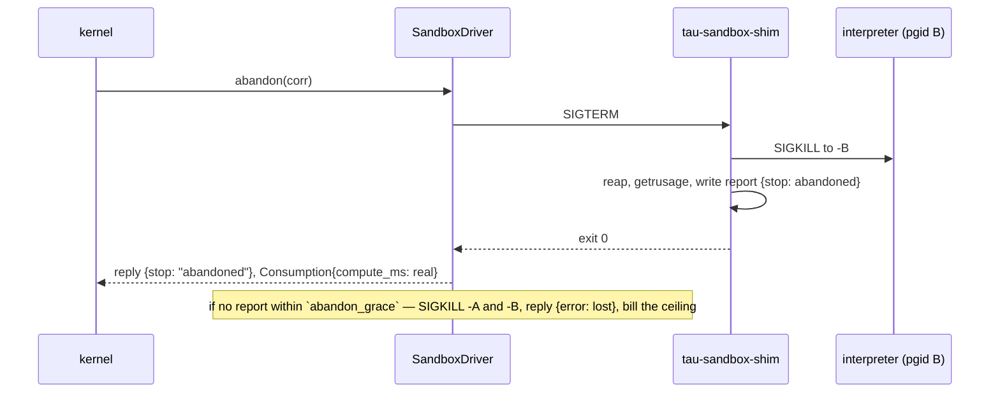

# ADR-0009: The sandbox driver v0 — a resource fence behind `send`, and the ladder above it

**Status:** Accepted
**Date:** 2026-09-15
**Deciders:** tau core

## Context

M2 is "hooks (native + Rule), sandbox driver v0, replay CLI" (HANDOFF §6).
Hooks landed ([ADR-0008](0008-hooks-and-attach.md), #84, #85). The sandbox
driver is the second M2 lane, and it is the one place in the design where the
system will run code it did not write: HANDOFF §3.1 D quarantines "OS
isolation" inside the sandbox driver — "subprocess/cgroups/namespaces;
Firecracker-class later" — and §3.2 ends the exposure ladder at "code-as-action
(via sandbox driver only)". The Tier 2 ASan leg over `drivers/sandbox/**`
(#61) is gated on the crate existing.

Nothing about a sandbox reaches the kernel. A sandbox is a driver: a
capability names it, a `send` carries the request, a reply carries the result
and a `Consumption` the kernel settles against the reservation. The kernel
never parses either ([ADR-0003](0003-substrate.md), invariant 2). What this
ADR settles is what the two payloads say, what the driver reports, how far
v0's isolation actually goes, and how a `cancel` reaches a process that is
already running.

Four constraints shape the answer:

- **`unsafe_code = "forbid"`, workspace-wide.** Every textbook way to set
  resource limits on a child — `setrlimit` between `fork` and `exec` — is a
  `pre_exec` closure, which is `unsafe` in `std` and `tokio` alike. The
  design cannot assume that escape hatch and does not need it (§4).
- **Drivers never raise.** `Driver::handle` returns `(Vec<u8>, Consumption)`
  and nothing else until the M3 error envelope exists ([ADR-0006](0006-model-bridge-contract.md),
  "Errors ride in the reply"). A run that was killed, a shim that failed to
  start, a request the driver cannot honour: each is a reply.
- **The reducer never reads a clock, and neither does a driver** by lint:
  `Instant::now` is denied everywhere but `driver/clock.rs`. A driver that
  wants to bound a run by wall time must do it without reading time (§4),
  and must not report `wall_ms` at all (§3).
- **Nothing reserved and inert** ([ADR-0001](0001-tau-rebooted.md)). A
  `network: deny` field the v0 driver could not honour, a `backend` enum with
  one variant, a per-request `limits` object the model has no basis to fill:
  none of it ships until it has a caller.

And one fact the whole ADR is built around, stated once so the rest can be
plain: **v0 is a resource fence, not a security boundary.** Subprocess plus
rlimits bounds how much CPU, memory, disk, and output a run may consume and
how long it may take. It does not hide the host filesystem, does not change
the uid, and does not deny the network. Where each of those begins is §6,
and every one of them arrives inside the driver, behind the same two payloads.

## Decision

### 1. One module, one binary, one tool

The driver is `tau_drivers::sandbox` (`drivers/src/sandbox/`), behind a
`sandbox` feature that is on by default and Unix-only. No new crate, for the
reason ADR-0006 gave: a module is the same code with one fewer `Cargo.toml`,
and the split is mechanical if the dependencies ever warrant it. HANDOFF §8's
`drivers/sandbox/**` is this path; #61 and `tier2.yml` read it as
`drivers/src/sandbox/**`.

The crate gains a second binary target, **`tau-sandbox-shim`**. The shim is
the supervisor process the driver spawns for every run, and it is the only
thing in the workspace that ever touches an rlimit. §4 explains why it exists;
the short version is that a supervisor that limits *itself* and then spawns
the target is the one shape that needs no `unsafe` and no per-platform
syscall, and it is also where every later rung of isolation goes.

Like every driver, it is **at most one tool** (ADR-0006 §5). One registration
is one interpreter, configured by the harness; a harness that wants Python
and a shell registers two drivers, named `python` and `sh` by the operator,
each with its own ceiling and capability. The model never chooses the
interpreter, the environment, or the limits: it chooses the code.

```
agent ──send(cap, request)──▶ kernel ──Delivery──▶ SandboxDriver     (protocol boundary)
                                                        │ spawn, new process group
                                                        ▼
                                                  tau-sandbox-shim   (isolation boundary)
                                                        │ setrlimit on self, then spawn
                                                        ▼
                                                  interpreter  main.py   (untrusted)
```

### 2. The wire shape: `v` on both sides, and a request a model can write

The types live in `tau_drivers::sandbox::wire`, not in `tau_kernel::bridge`.
ADR-0006 put the model bridge in the kernel because two parallel lanes had to
agree on the bytes before either wrote code; here there is one lane, and
`libtau` never learns this shape — it projects `describe()` and renders reply
bytes verbatim (ADR-0006 §5). A program that calls the sandbox directly
without depending on `tau-drivers` writes the JSON below by hand; the JSON is
the contract, the Rust types are versioned with the crate (ADR-0006 §8).

**The request**, one JSON object per `send` to a sandbox capability:

```json
{
  "v": 1,
  "code": "import sys\nprint(sum(int(x) for x in sys.stdin.read().split()))\n",
  "stdin": "1 2 3\n"
}
```

| Field | Type | Meaning |
|---|---|---|
| `v` | `u16`, optional | Sandbox wire version, `1`. **Absent means the version this driver's `describe()` projected.** A present `v` the driver does not implement is `error.unsupported`. |
| `code` | string | Written to the entry file in a fresh working directory before the interpreter starts. Bounded by the driver's `code_bytes`; over it is `error.unsupported`, nothing run. |
| `stdin` | string, optional | Fed to the interpreter's standard input, then closed. Absent is an empty stdin, closed at once. |

`v` is optional on the request because of a fact the model bridge never had
to face: a tool driver's invocation payload is *exactly* the model's
`tool_call.input` bytes, and a model fills the schema it was shown, not a
version field. The schema `describe()` projects is the current version by
construction, so "absent" is well-defined and never a guess. A program
building requests by hand sets `v` and is refused loudly on a mismatch,
which is the ADR-0006 rule.

No `argv`, no `env`, no `limits`, no `cwd`. Each was considered (Alternatives)
and each is the harness's decision, made once at registration, because the
model is the untrusted party and does not get to size its own cage. Every one
of them is additive as an optional field, without a `v` bump, on the day a
*program* — not a model — needs it.

**The reply**, one JSON object per `Reply`:

```json
{
  "v": 1,
  "stop": { "exit": 0 },
  "stdout": "6\n",
  "stderr": "",
  "truncated": { "stdout": false, "stderr": false },
  "usage": { "cpu_user_us": 18211, "cpu_sys_us": 4102, "max_rss_bytes": 9437184 }
}
```

`stop` says how the run ended, and is one of:

| `stop` | Meaning | Usage is |
|---|---|---|
| `{ "exit": n }` | The interpreter exited with status `n`. `0` is not special to the driver. | real |
| `{ "signal": "SIGSEGV" }` | The interpreter died of a signal it did not ask for. Named, not numbered: numbers differ by platform. | real |
| `"cpu_limit"` | The host kernel killed it at `RLIMIT_CPU`. | real, at the ceiling |
| `"wall_limit"` | The shim killed it at the wall bound. | real |
| `"abandoned"` | The shim killed it because the requester was cancelled (§5). | real |
| `{ "error": { "kind": ..., "message": ... } }` | The driver could not run it, or lost it. | see §3 |

```json
{ "v": 1, "stop": { "error": { "kind": "unsupported", "message": "code is 131072 bytes; the bound is 65536" } },
  "stdout": "", "stderr": "", "truncated": { "stdout": false, "stderr": false },
  "usage": { "cpu_user_us": 0, "cpu_sys_us": 0, "max_rss_bytes": 0 } }
```

| `error.kind` | When | Billed |
|---|---|---|
| `unsupported` | A `v`, a field, or a `code` size the driver cannot honour. Nothing ran. | nothing |
| `host` | The driver could not start the run: shim binary missing, scratch directory not creatable, spawn refused by the host. Nothing ran. | nothing |
| `lost` | The run started and its report never arrived: the shim died, or the driver's last-resort kill reached it (§5). Something ran and the driver cannot say how much. | **the ceiling** |

A killed run is a stop reason, not an error, on the same argument ADR-0006 §3
makes for `max_tokens` and `refusal`: the run happened, the usage is real,
and the loop's response is a policy question for the caller. `stdout` and
`stderr` are present on every reply, killed or not, holding whatever the run
produced before it ended — the traceback that explains a `cpu_limit` is the
thing the model needs to read.

**Output is bounded and the bound is visible.** The driver drains both pipes
to the end so a chatty run never stalls on a full pipe, keeps the first
`output_bytes` of each, and sets `truncated` when it dropped anything. Bytes
are rendered as UTF-8, lossily; a run that wants to return binary encodes it.

`usage` is for the caller's information, in the interpreter's native units.
It is *not* the accounting — that is the `Consumption` of §3 — and
`max_rss_bytes` in particular has no budget dimension, because a peak is not
summable across calls.

### 3. Consumption: `compute_ms`, and nothing that is already charged

The driver attaches one dimension to every reply that ran something:

| Dimension | Reported as | From |
|---|---|---|
| `compute_ms` | user + system CPU time of the run, in milliseconds, rounded up | the shim's `getrusage(RUSAGE_CHILDREN)` after it reaped the interpreter |

No new `DimKey`. `budget.rs` already says why the dimensions are a map: "a
classifier reports `compute_ms`, a sandbox reports CPU seconds". CPU seconds
*are* compute time, and one reserved key means a harness that wants "this
subtree may run cheap classifiers but never code" writes one budget line and
a namespace, not a second dimension. The doc comment on `DimKey::ComputeMs`
("as reported by local ML drivers") is narrower than the key; it is under
`kernel/src/abi/` and is corrected on the next PR that has a reason to be
there, not by this lane.

**Not reported, on purpose:**

- **`wall_ms`.** The reducer charges an agent's `wall_ms` on every `Tick`
  while it waits for the reply (M1b). A driver that also reported the run's
  wall time would charge the same seconds twice. This is also why the driver
  never needs to *measure* wall time, only to bound it (§4).
- **`calls`.** The kernel adds one itself at `send`.
- **`tokens`, `cost_microusd`.** A run costs no money the driver can see. A
  harness that meters host CPU in dollars derives it from `compute_ms` at
  its own rate.

**The ceiling** (ADR-0006 §7 style) follows from one configured number:

| Dimension | Derivation | Example (`cpu: 2s`) |
|---|---|---|
| `compute_ms` | `cpu` in whole seconds × 1000 | 2,000 |

The shim sets `RLIMIT_CPU` hard and soft to `cpu`, so the host kernel
enforces the ceiling on the interpreter even if the shim and the driver both
die. A run that hit it reports `cpu_limit` and bills what `getrusage` says,
which is the ceiling to within the host's accounting granularity.

Two honest consequences:

- **An agent with no `compute_ms` grant cannot run code**, however many
  sandbox capabilities its namespace holds: the `send` is refused as
  `NoGrant` before delivery, like any other dimension. This is the
  containers-of-agents story from HANDOFF §1 arriving for free — the cheap
  subtree cannot spend CPU because it was never granted any — and it is an
  obligation on the harness author to grant `compute_ms` where code should
  run.
- **A fork tree can report above the ceiling.** `RLIMIT_CPU` is per process;
  a run that forks gets the limit again per child, and `RUSAGE_CHILDREN`
  reports what every waited descendant used. The kernel records the excess as
  overdraft on the agent, and the supervision policy (#18) acts on it. v0
  does not pretend the ceiling is hard across a fork tree; the cgroup rung
  of §6 makes it so.

### 4. The v0 floor: what the shim does, and why it is a process

The shim exists because of three things that have no `unsafe`-free,
cross-platform answer from inside the driver's own process:

1. **Setting rlimits on a child** needs `pre_exec`, which is `unsafe`. A
   process that sets limits on *itself* with a safe wrapper and then spawns
   is the same effect: limits inherit across `spawn`.
2. **Reading the child's CPU time** needs `wait4` or `RUSAGE_CHILDREN`, which
   `std`'s and `tokio`'s `Child` do not expose, and which is only exact when
   the reader has one child. The shim has exactly one.
3. **Bounding wall time without reading a clock** is one blocking `wait` on a
   thread and one `recv_timeout` on a channel: a duration, never an
   `Instant`. Zero `#[allow]`s.

The driver, per run:

1. creates a fresh scratch directory, writes `code` to the configured entry
   file inside it;
2. spawns the shim in a **new process group** (`CommandExt::process_group`,
   safe `std`), with stdin, stdout, stderr piped, the scratch directory as
   `cwd`, and **exactly** the configured environment — nothing inherited from
   the harness, so no `ANTHROPIC_API_KEY`, no `AWS_*`, no `HOME` that is not
   the scratch directory;
3. writes `stdin` and closes it; drains both pipes with the output bound;
4. waits for the shim's report (a JSON file in the scratch directory; the
   interpreter can reach it, see the cannot-do table in §6), settles the
   reply and the `Consumption`, deletes the scratch directory.

The shim, per run:

1. `setrlimit` on itself — `RLIMIT_CPU` (the ceiling), `RLIMIT_AS`
   (`memory_bytes`, Linux; §6 for macOS), `RLIMIT_FSIZE`, `RLIMIT_NOFILE`,
   `RLIMIT_CORE = 0`; each from its arguments, which the driver derived from
   config;
2. spawns the interpreter in **its own** new process group, inheriting the
   pipes and the limits;
3. waits on a thread; on the wall bound, on `SIGTERM` from the driver (§5),
   or on the interpreter's exit, `kill(-pgid, SIGKILL)`s the interpreter's
   group, reaps, and writes the report: how it stopped, the exit status or
   signal, `getrusage(RUSAGE_CHILDREN)`;
4. exits `0`. Any other exit, or no report, is `lost` at the driver.

Two groups, not one, because a shim that killed its own group would die
before writing the report. The driver's last resort (§5) kills both.

**Platform.** The floor is Linux; macOS runs it for the developer loop with
one bound missing. `memory_bytes` is refused *at registration* on macOS
(`ConfigError`), because XNU accepts `RLIMIT_AS` and does not enforce it,
and a limit that is set and not enforced is the silent degradation ADR-0006
forbids. A laptop runs without a memory bound and knows it; CI (#61) runs
on Linux with one.

All of this is ordinary Unix — rlimits, process groups, `getrusage` — through
safe wrappers (`rustix` is the candidate: its `setrlimit`, `getrusage`, and
`kill_process_group` are safe functions; the implementation issue decides).
The shim is a few hundred lines with no `tokio` and no dependency on the
kernel crate; it is the thing #61's sanitizer leg is for.

### 5. Cancel: abandon reaches the shim, the shim reports, the driver has a last resort

`cancel` is two-phase (ADR-0002, M1a): freeze the subtree, then
`Driver::abandon(corr)` for every open request the subtree holds, then a
grace deadline, then abort. The driver's half:



- **`abandon` is a table lookup and a signal**, mirroring the model drivers'
  flight registry (`transport.rs`): `corr → shim pid`, in a `BTreeMap` behind
  the driver's own lock, with the same `abandoned_early` set for the delivery
  that was queued but not yet polled when the cancel arrived. A run abandoned
  before it started answers `abandoned` with nothing billed and nothing
  spawned.
- **The reply is real.** An abandoned run reports `stop: "abandoned"`, the
  output it produced, and the CPU it burned. The kernel delivers it if the
  owner is in its grace period and dead-letters it after (`Driver::abandon`'s
  doc); either way the budget settles against what actually happened.
- **The last resort bills the ceiling.** If the shim does not report within
  `abandon_grace` (configured, default one second), the driver `SIGKILL`s the
  shim's group and, from the partial report the shim wrote at spawn, the
  interpreter's group, and replies `error.lost` with `compute_ms` at the
  ceiling. Unknown consumption is billed *up*, never down: the reservation
  was already taken, so nothing new leaves the agent, and a driver that
  guessed low would be the one place in the system where a cancel is cheaper
  than a completion.
- **The same path handles a wall-bound kill** with `stop: "wall_limit"`, and
  a driver drop: `SandboxDriver`'s `Drop` signals every open run, so a
  harness shutting down leaves no interpreter behind.
- **The wall deadline is counted from the partial report** (amended by
  [#220](https://github.com/tau-rs/tau/issues/220)). The shim's wall clock
  starts once it has set its rlimits, spawned the interpreter, and written
  the partial report; the driver watches for that report and arms its own
  `wall + abandon_grace` when it appears, so the grace covers the shim's
  kill-reap-report tail and nothing else. Until the report appears, the
  same `wall + abandon_grace` from the spawn bounds the startup. Counting
  from the spawn made the grace absorb the startup too, and on a loaded
  host that turned a healthy `wall_limit` into `lost` at the ceiling.

Nothing here is a syscall or a kernel change. `abandon` already exists; the
sandbox is the first driver whose abandon has a process to reach.

### 6. The ladder: where namespaces, cgroups and Firecracker begin

The driver is the protocol boundary and the shim is the isolation boundary.
The wire shape of §2 does not know which rung it is on; a rung changes what
the shim does before it spawns the interpreter, the rows of the table below,
and the sentence `describe()` shows the model. It never changes the request
or the reply.

| Rung | Mechanism | Adds | Lives in |
|---|---|---|---|
| **v0 (this ADR)** | subprocess, rlimits, scrubbed env, fresh cwd, process-group kill | CPU, address space, file size, open files, output, wall; crash containment | the shim |
| v1 | Linux user + mount + net + pid namespaces; macOS `sandbox-exec` profile | no network; a private filesystem view; no host pids; the fork tree dies with its namespace | the shim, before spawn |
| v1 | cgroup v2 | CPU and memory bounded *across* the fork tree; `cgroup.kill` | the shim |
| v2 | Firecracker-class microVM | a kernel boundary | a second backend behind the same `wire` |

What v0 **cannot do**, on purpose or by platform, and where each goes:

| Not possible at v0 | Why | Home |
|---|---|---|
| deny the network | rlimits have no network dimension; the run gets no proxy and no credentials, but the host's stack is there | v1 shim: net namespace (Linux), `sandbox-exec` `(deny network*)` (macOS) |
| hide the host filesystem, or run as another uid | needs a mount namespace, `chroot`, or root | v1 shim |
| bound CPU or memory across a fork tree | rlimits are per process; the excess is overdraft (§3), not a breach of the fence | cgroup v2 |
| bound memory on macOS | XNU does not enforce `RLIMIT_AS`; refused at registration rather than set and ignored | Linux; v1 `sandbox-exec` has no memory bound either, so this stays Linux |
| guarantee every descendant is dead | a process that calls `setpgid` leaves the group `kill(-pgid)` reaches | pid namespace, `cgroup.kill` |
| account CPU of a reparented orphan | `RUSAGE_CHILDREN` counts waited descendants only | cgroup `cpu.stat` |
| keep the report from the interpreter | same uid, same scratch directory: the run can overwrite its own report | v1 mount namespace; until then a forged report is bounded by the ceiling the reservation already took |
| per-request `argv`, `env`, `limits`, `cwd` | the model does not size its own cage | additive optional fields, when a program needs them |
| stream output (`MsgKind::Partial`) | one reply per run | additive, with the model bridge's streaming |
| keep state between runs | fresh cwd every time | a store driver, or an additive `workspace` field |
| report `wall_ms` | the reducer already charges it on ticks | nowhere |

**Sequencing of the rungs.** v1's two rows are separate PRs behind separate
config: `network: Deny` is refused at registration on a host that cannot
provide it (an Ubuntu with unprivileged user namespaces off, a macOS without
`sandbox-exec`), never silently downgraded. Each rung is an amendment to this
ADR that moves rows out of the cannot-do table and into the ladder. A rung
that exists in code and not in the table is the v1 pattern ADR-0008 warns
about.

### 7. `describe()`: the model sees the cage it is in

```json
{
  "description": "Run Python 3 code. The code is written to main.py in an empty directory and run with `python3 main.py`; `stdin` is fed to it. Limits: 2 s CPU, 256 MiB memory, 10 s wall, 64 KiB of stdout and of stderr. No network. Nothing persists between calls.",
  "input_schema": {
    "type": "object",
    "properties": {
      "code":  { "type": "string", "description": "The program." },
      "stdin": { "type": "string", "description": "Standard input for the program." }
    },
    "required": ["code"],
    "additionalProperties": false
  }
}
```

- The tool's name is the `DriverId` (`python`, `sh`) the operator chose
  (ADR-0006 §5). Two interpreters are two registrations.
- The description is composed **at construction** from the config, so
  `describe()` stays cheap and pure as `Driver::describe` requires. The
  limits are in it because a model that knows the bound writes code that
  fits it; "No network" is stated at v0 as a fact about what the run is
  *given*, and becomes a fact about what it is *denied* at v1. The harness
  may replace the sentence (`description` in config); it cannot remove the
  limits from it.
- `additionalProperties: false`, so `v` is not something the model writes
  (§2) and a hallucinated `argv` is `bad_args` at the loop, never a silent
  drop at the driver.
- The schema is derived from the request type with `schemars`, the same type
  the driver deserializes with: one source of truth, as ADR-0006 §5 and
  HANDOFF §3.2 require.

Through the loop, a call is: `tool_call.input` → sent verbatim as the payload
→ reply bytes rendered verbatim as `tool_result.content`. The model reads the
JSON reply of §2, exit status and traceback included, and self-corrects. The
loop does not learn this ADR; that is the point of ADR-0006 §5's symmetry.

### 8. Versioning

The rules are ADR-0006 §8's, restated for the one difference:

- `v` is bumped for a change a v1 reader cannot parse: a new `stop` shape, a
  new required field, a changed meaning. An optional field with a defaulted
  deserialization is additive and does not bump `v`.
- The driver replies `error.unsupported` to a present `v` it does not
  implement. **An absent `v` is the projected version**, never a guess (§2).
- The JSON in this ADR is the fixtures in `drivers/tests/fixtures/sandbox/`;
  they round-trip through the types byte-for-byte in value, and the test says
  so if the two diverge.
- A rung of §6 is not a version: it changes the shim and the tables, not the
  bytes.

## Consequences

- **The kernel is untouched.** No syscall, no `abi/` change, no `log.rs`
  change, no new `DimKey`. The sandbox is a driver behind `send`, and the
  `Entry` freeze (#10) does not wait on it.
- **The implementation issue is M2b-drivers** ([#94](https://github.com/tau-rs/tau/issues/94)).
  Its done-when is derived from §2–§7: the module and the shim, the fixtures,
  the flight registry, a test per row of the `stop` table, a cancel test that
  proves the interpreter is gone, a `libtau` test that projects the schema
  and runs one call through the tool loop against the stub model. #61 flips
  to `status:ready` when it lands.
- **The harness has a new obligation**: grant `compute_ms` where code should
  run, ship `tau-sandbox-shim` beside the harness binary (the default shim
  path is next to `current_exe`; a config field overrides it), and treat the
  v0 host as disposable — it is a resource fence, and the sentence "no
  network" in `describe()` is about what the run is given until v1.
- **Overdraft is the fork-tree story.** A run that forks can report above its
  ceiling, and the kernel already records that on the agent. #18 (supervision
  policy for a driver over its ceiling) gains its first concrete driver.
- **`compute_ms` gains a second producer** and its `abi/` doc comment is one
  clause narrow. Corrected on the next PR with a reason to touch that file.
- **Tier 2 learns a path.** `tier2.yml`'s auto-run paths gain
  `drivers/src/sandbox/**` with #61, and the ASan/LSan leg runs the crate's
  tests, shim included.
- **The obligations this creates:**
  - Every `stop` variant and every `error.kind` has a test that produces it
    with a real process, not a mock.
  - A rung of §6 is an amendment to this ADR: rows move from the cannot-do
    table to the ladder, and `describe()`'s sentence changes with them.
  - A new field on the request is optional, defaulted, and documented in the
    §2 table before it ships.

## Alternatives considered

**`pre_exec` with a per-crate `unsafe` exception.** The textbook shape:
`setrlimit` between `fork` and `exec` in the driver's own process. Rejected:
`forbid` cannot be overridden below the workspace, so this is a workspace
lint change for one closure, and it still leaves the CPU-time report to
`wait4`, which `tokio`'s `Child` does not expose. The shim needs neither and
is where the next rungs go anyway.

**`prlimit(2)` on the child after spawn.** Safe, no shim, and Linux-only:
macOS has no `prlimit`. Two platform paths for the floor is the drift this
ADR's tables exist to prevent, and the window between `spawn` and `prlimit`
is a window.

**A shell wrapper (`sh -c 'ulimit -t 2 -v ...; exec "$@"'`).** Portable in
name only — `ulimit -v` is not honoured on macOS and the shell's flag set
varies — and it gives the untrusted interpreter a shell as its parent.

**The driver spawns the interpreter directly and reads `/proc/<pid>/stat` for
CPU.** Racy at exit, Linux-only, and it has no way to bound the run without
`pre_exec`.

**Re-exec the harness binary as the shim** (`current_exe` plus a marker
environment variable, the `sccache` shape). No second binary to ship.
Rejected: it makes every harness's `main` responsible for dispatching to
`shim_main` before doing anything else, and forgetting it is a harness that
runs untrusted code with no limits and no error. A separate binary that is
missing is `error.host`, loudly.

**The model chooses `argv`.** More general; the exposure ladder in HANDOFF
§3.2 could end at "run any command". Rejected at v0 because the run has the
harness's uid and the host filesystem: `argv` is "do anything the harness
can", and a fixed interpreter with the code in a file is exactly as
expressive for code-as-action. It is one optional field away when v1's
filesystem view makes it safe to offer.

**Per-request `limits`.** Lets a program ask for less than the ceiling.
Rejected as inert: the reservation is the ceiling either way and unspent
budget returns at settle, so a smaller request bounds blast radius and
nothing else. Additive when a caller wants that.

**Report `wall_ms` alongside `compute_ms`.** Rejected: the reducer already
charges the agent's wall on every `Tick` it waits through; a second charge
is a double bill, and measuring it would need the one clock read the lint
denies.

**A custom `cpu_s` dimension.** Rejected: `compute_ms` is CPU time in
milliseconds, the key exists, and one key means one budget line for "may
compute, may not spend tokens".

**Bill an unreported run at zero.** Rejected: it makes a cancel cheaper than
a completion, and the one driver that runs untrusted code would be the one
whose accounting could be gamed by killing the shim.

**Types in `tau_kernel::bridge`, like the model bridge.** Rejected: the
bridge is carried by the kernel because two lanes needed it before either
existed; no second lane needs the sandbox shape, `libtau` renders bytes
verbatim, and the kernel should carry no vocabulary it has no neighbour for.

**Make v0 Linux-only with user + net namespaces in the shim, so "no network"
is enforced from day one.** Considered seriously. Rejected for v0 because
unprivileged user namespaces are restricted by default on current Ubuntu (AppArmor
restriction since 23.10) and absent on macOS, so the floor would be
"enforced on some hosts" — which is a `network` field the driver sometimes
cannot honour, and that is the reserved-and-inert shape. It is the first row
of v1, refused at registration where the host cannot provide it.

**Text rendering of the reply (`exit 0` / `--- stdout ---`).** Friendlier
to a model, unparseable by a program. Rejected at the driver: the reply is
JSON, and a loop that wants prose renders it, which is additive and
loop-side.

[`Driver`]: ../../kernel/src/driver.rs
[`Consumption`]: ../../kernel/src/abi/budget.rs
