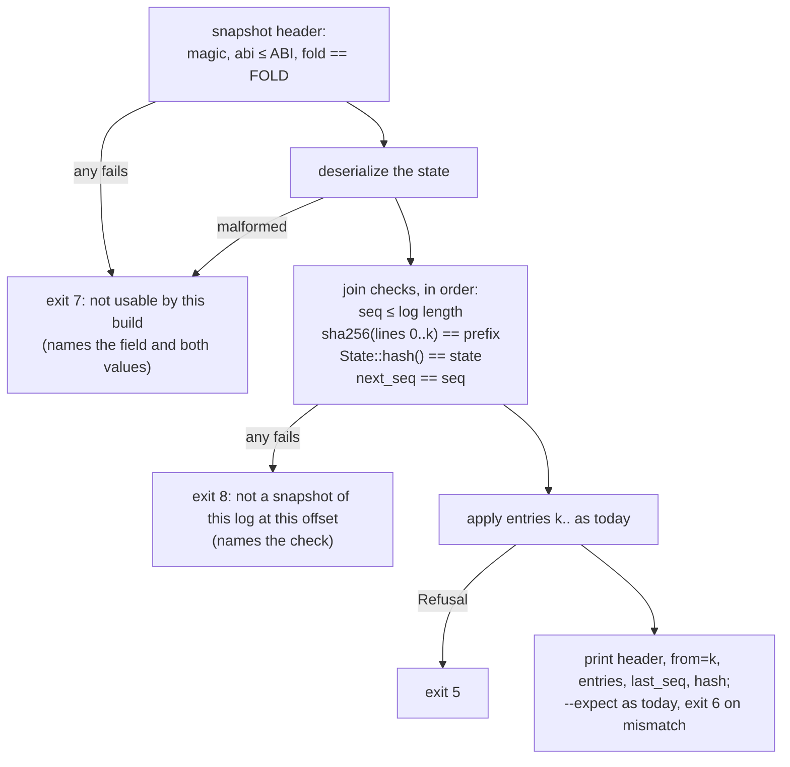

# ADR-0011: Snapshots — a fold you may skip, never one you must trust

**Status:** Accepted
**Date:** 2026-09-16
**Deciders:** tau core
**Amends:** [ADR-0004](0004-abi-freeze.md) (`SnapshotHeader` joins
`kernel/src/abi/`; no bump), [ADR-0010](0010-entry-freeze.md) (`State` stays
out of the directory, versioned by a fold number of its own; the re-stamp
after restore is named)

## Context

The log is the kernel and everything else is cache (ADR-0003). The reducer is
a pure fold over the log's entries, and `State::hash()` — sha256 of the
canonical state as serialized — is the promise that any build folds a log to
the same result (ADR-0010 §7, the corpus, the nightly sentinel). A snapshot
is that cache made durable: the state after the first *k* entries, written
down so the next reader can start at entry *k* instead of at zero. HANDOFF §4
item 7 decided it on day one — "reducer state fully serializable; replay =
snapshot + tail; designed in, implemented at M3" — and this ADR is the
design. The kernel work is a follow-on ([#119](https://github.com/tau-rs/tau/issues/119)).

What is already true, and shapes the decision:

- **The canonical state is serializable and round-trips.** #62 split
  `State` into canonical fields and derived indexes; only the canonical
  fields reach the wire, and deserialization lands in a private `Canonical`
  mirror that rebuilds the indexes. `state_round_trips_through_serde_with_its_indexes`
  pins the round trip; `the_hash_does_not_see_the_completion_ordinal` already
  folds a round-tripped state and a never-serialized one forward through the
  same entries and gets one hash. That test *is* replay = snapshot + tail, in
  miniature, and it passes today.
- **The state carries its own offset.** `next_seq` is a canonical field: the
  position the next entry must carry. A serialized state already says where
  its tail begins.
- **The hash is a function of the log alone, as of #112.** The notice a
  `Cancelled` entry makes the fold synthesize was stamped with the build's
  `ABI`, and mailboxes were hashed with the stamp. Now every mailbox envelope
  serializes without its `abi`, and a deserialized envelope is re-stamped with
  the *restoring* build's `ABI`. A snapshot is exactly a deserialized state,
  so the re-stamp is something this ADR must take a position on (§3).
- **The hash's definition has moved three times without an `ABI` bump.**
  #62 dropped the completion ordinals and the indexes, #80 added `hooks`
  (with a bump, for other reasons), #112 dropped the envelope stamp. Each
  was a reducer change with an ADR-level reason, per `corpus/README.md`, and
  each re-pinned what it had to. None was an ABI event, and none should have
  been: `ABI` names what a log's *lines* are, not what the fold makes of
  them.
- **`tau replay` exists** (#91, #111). It reads a header, refuses what it
  cannot read naming both numbers, folds every entry, prints the hash, and
  has a distinct exit code per way of stopping. The snapshot reader is the
  same tool with one more input.

The failure this ADR exists to prevent is the silent one: a reader continues
from a snapshot it should not have accepted, and produces a state that is the
fold of nothing that ever happened. That is worse than a refold from zero by
any margin, because a refold costs time and a wrong state has no name in the
model. So every decision below is derived from one question: **what must a
reader be able to check before it trusts the prefix it did not fold?**

## Decision

### 1. What a snapshot is

A snapshot is **the canonical `State` after entries `0..k`, plus a header a
reader can check before deserializing the state.** Two lines of JSON, framed
like a log (ADR-0010 §4): line 1 the header, line 2 the state as
`State::hash()` serializes it, `\n`-separated, nothing else.

```text
{"magic":"TAUS","abi":2,"fold":1,"seq":5017,"prefix":"…","state":"…"}
{"next_seq":5017,"next_agent":…,"agents":{…},…}
```

The header, field by field, each justified by the refusal it makes possible:

| Field | What it says | Without it, what a reader cannot tell |
|---|---|---|
| `magic` | `TAUS`: a snapshot, not a log | a log and a snapshot are both JSON lines; the first byte must say which |
| `abi` | the `ABI` of the build that wrote it | the state embeds frozen types (`Endpoint`, `Budget`, `HookPoint`, …); a variant added at `ABI` 3 is in the body, and a reader at 2 must refuse before it meets it |
| `fold` | the fold version (§2) of the build that wrote it | whether the state is the fold this build would have produced, or another reducer's |
| `seq` | *k*: the number of entries folded in | where the tail begins, before parsing a body that may be megabytes |
| `prefix` | sha256 of the log as written, header line through entry *k−1* | whether this is a prefix of *this* log, or of another one whose ids happen to line up |
| `state` | `State::hash()` at *k*, as the writer computed it | whether this build's canonical serialization is the writer's, field for field |

**Why the offset is enough for the state and not enough for the reader.**
The fold is a pure function: `fold(S, tail)` equals `fold(log)` whenever
`S == fold(log[..k])`. Given that equality, `k` alone locates the tail and
nothing else is needed; the state needs no hook program, driver or clock to
continue (ADR-0008: the fold confirms, never runs). What the offset cannot
give is the equality itself. Three things can make it false, and each has a
field above: a different log (`prefix`), a different fold (`fold`), a
different serialization of the same fold (`state`). `prefix` is the one that
looks optional and is not. A snapshot of log A joined to log B at the same
`k` is *not* reliably refused by the reducer: `seq` is dense in both, a
`Tick` is accepted at any later time, an `Exited` for any live id, a
`Spawned` whenever the allocation counters coincide — and they coincide often
between two runs of the same generator. Without the digest, the join is
guessed right by luck and wrong in silence.

**The `abi` travels, and it is the log's rule.** The reader accepts
`header.abi <= ABI`, exactly as for a log (ADR-0004), because the reason is
the same: the body may contain a shape the reader has never seen. It is not
compared to the log's header `abi` separately, because `prefix` covers the
log's header line and a snapshot of a log at another `abi` fails there.

**`seq` is in two places on purpose**, header and `next_seq` in the body, for
the reason ADR-0010 §3 kept `Entry::seq()` in one: the header is what a reader
checks *before* the body exists in memory, and the body is not frozen (§2).
The reader requires them equal (§4).

**`prefix` is over bytes as written**, the `Log::write_to` form ADR-0010 §4
freezes and `log_file_wire_format` pins: the header line, then each of
entries `0..k` re-serialized, each followed by `\n`, blank lines excluded.
Defined over the re-serialization rather than the file so a log that was
stored with different whitespace still matches, and so a writer that never
had the file — the running kernel — can maintain the digest line by line as
it appends. For a log tau wrote the two coincide, which
`every_frozen_type_round_trips` guarantees.

### 2. The freeze: the header is ABI, the state is the fold's, and the fold gets a number

**`SnapshotHeader` joins `kernel/src/abi/`.** It is the log header's twin:
the thing a reader parses to decide whether it may parse the rest. If its
shape churned, an old snapshot could not even be refused legibly. It arrives
with an `insta` snapshot and a round-trip test, in the kernel follow-on,
under the `abi-change` label with this ADR linked. No bump: no existing byte
changes, and nothing a reader may assume about a *log* changes (ADR-0010 §2's
test for when the number must move). ADR-0005 set the precedent.

**`State` does not join the directory, and is not frozen.** Re-derived from
what breaks: a snapshot written by build *N* is loaded on build *N+1*. Either
*N+1*'s fold is *N*'s — same canonical fields, same arithmetic — and the
snapshot is exactly what *N+1* would have folded, or it is not, and the
snapshot is a stale cache: a state *N+1* could never produce from that log.
The freeze's promise, "additively or not at all", is the wrong shape for
this. Twice already the right change to the canonical state was a *removal*
(#62's ordinals, #112's stamps), which the freeze forbids for good. And an
additive change is no safer here than a removal: a snapshot from before #80
deserializes on a build after it with `hooks` defaulted to empty, while the
full fold of the same log would have populated it from its `Attached`
entries. Under the freeze that snapshot is *accepted*, and it is wrong.
Freezing the state buys nothing a snapshot reader can use and costs the
reducer its right to be corrected.

So the canonical state stays where it is, in `reducer.rs`, and stays
correctable. Its wire form is pinned as it is today — by the fixture
hash snapshots in `kernel/tests/`, `PINNED` in the sim, and the corpus
sidecars — and a change to it is a reducer change with an ADR-level reason
(`corpus/README.md`), as before. What it gains is a name for "which fold":

**`FOLD: u16`, in `reducer.rs`, bumped by every change that moves a pinned
hash.** Two builds with the same `FOLD` fold every log to the same state;
that is what the number claims, and the corpus is the evidence. A reader
accepts a snapshot only at `header.fold == FOLD` — equality, not `<=`,
because the fold is one function or a different one; there is no additive
middle. It is a second version number next to `ABI`, and ADR-0010 rejected
one of those (`entry_v`) because it "always bumps together" with `abi`. This
one does not: of the four canonical-state changes so far, one coincided with
a bump and three did not, and the two `ABI` bumps changed the fold not at
all. Two numbers that move for different reasons are two facts, not one fact
with a chance to disagree.

The number is held by the same gate that holds the hashes. The fixture
snapshot tests already fail in a pull request when the fold changes; the
follow-on pins `FOLD` in the same `insta` snapshot as the fixture hashes, so
the diff a reviewer accepts shows the number and the hashes moving together,
or shows the hashes moving and the number not, which is the review comment.
`corpus/README.md`'s re-pin rule gains one clause: a re-pin bumps `FOLD`. A
bump of `ABI` alone does not touch it (ADR-0010 §6: "a bump is not a cause").

| A build at | reading a snapshot at | does |
|---|---|---|
| `ABI` 2, `FOLD` 1 | `abi: 2, fold: 1` | accepts, checks the join (§4) |
| `ABI` 3, `FOLD` 1 | `abi: 2, fold: 1` | accepts: the state's shapes are ones it knows, the fold is its own |
| `ABI` 2, `FOLD` 1 | `abi: 3, fold: 1` | refuses at `abi`, naming 3 and 2: the body may hold a shape it cannot parse |
| `ABI` 2, `FOLD` 2 | `abi: 2, fold: 1` | refuses at `fold`, naming 1 and 2: the prefix was folded by a reducer this build has replaced |
| any | `magic` not `TAUS` | refuses: not a snapshot |

The refusal is never an error in the snapshot. It is the reader saying
"refold from zero"; the log is still there, and the log is the truth.

### 3. The hash contract, and what restore changes that the hash does not see

**The promise:** for every log at `abi ≥ 2`, every `k` in `0..=len`, and
every build whose `FOLD` matches the snapshot's,

```text
hash(fold(log)) == hash(fold(snapshot_k, log[k..]))
```

and a build whose `FOLD` does not match refuses rather than folding. Together
with ADR-0010 §7 — every build at `ABI ≥ 2` folds the whole log to one hash —
this makes the snapshot invisible to the sidecar: a corpus log replayed from
any of its own snapshots on any accepting build matches its `.hash`.

**What the promise is about, and what it is not.** It is about the canonical
state: what the log determines. It is not about derived `PartialEq` on
`State`, and two things a restored state carries differ from a full fold's
under that comparison:

- **Compacted completion ordinals** (#62). `From<Canonical>` renumbers the
  unclaimed completions `0..n`. `wait(Any)` still returns in completion order
  — `the_hash_does_not_see_the_completion_ordinal` folds both forward and
  checks the next claim agrees — so nothing observable moves.
- **Re-stamped envelopes** (#112). Every undrained envelope in every mailbox
  comes back stamped with the restoring build's `ABI`. In a full fold, a
  `Replied` or `Emitted` envelope carries the stamp its log entry carries and
  a synthesized cancel notice carries the folding build's. After a restore
  on a build at `ABI` 3 of a snapshot whose tail holds a reply written at 2,
  the agent that `recv()`s it sees `abi: 3` where a full fold on the same
  build would hand it `abi: 2`.

The second is observable, and this ADR accepts it, for three reasons. First,
the alternative is not available: the stamp left the canonical state so that
the hash would stop depending on the build, and a full fold on two builds
already disagrees on the synthesized notice's stamp — restore is not adding a
disagreement, it is joining one that exists. Second, the stamp is provenance
the kernel never decides on: `the_hash_does_not_see_an_envelope_abi_stamp` is
the invariant, and no code in `libtau`, `drivers` or `sim` reads
`Msg.abi` off a delivered envelope. Third, the honest reading of the field
survives: `abi` on an envelope in hand says which build handed it over, and
after a restore that is the restoring build.

So the rule, stated once: **the `abi` stamp on a delivered envelope is the
handing-over build's, and replay does not preserve it.** A program that
branches on it is relying on something the log does not determine, which is
ADR-0003 invariant 4 by another name. Everything else an agent can observe —
mailbox contents and order, budgets, reservations, status, corrs, completions
and their order, hooks — is canonical and identical.

### 4. What `tau replay` does with a snapshot, and when it refuses

`tau replay <log> --from <snapshot>` folds the tail. It reads the log's
header and applies today's rules to it (magic, `abi <= ABI`, exit 3), then
the snapshot's header, then walks the log:



Two new exit codes, because the two answers call for different actions: 7
means *use another build or refold from zero*; 8 means *this snapshot and
this log do not belong together*, and no build will make them. Inside each,
the message names the check that failed and both values, as the existing
codes do. The order inside 8 is cheapest-first and most-specific-first:
`seq` beyond the end is caught before any hashing; the `prefix` digest is
computed on the lines the reader skips anyway; the state re-hash catches a
canonical field added or dropped without a `FOLD` bump — the policy
violation §2 cannot make impossible, made loud; `next_seq` last, because
if the first three hold it can only disagree by a corrupted body.

The full-log path is unchanged: `tau replay <log>` with no `--from` is
exactly #91's contract, and `every_corpus_log_folds_to_its_sidecar` keeps
proving it. Writing a snapshot is `tau snapshot <log> --at <k> <out>` in the
same binary: fold `0..k`, write the two lines, refuse (exit 5) if the fold
refuses first. `--at` defaults to the whole log. Both verbs are the
follow-on's.

### 5. Tests: what already holds, and what the follow-on must add

Already pinned on `main`, and this ADR relies on them as they are:

| Test | What it already proves for snapshots |
|---|---|
| `state_round_trips_through_serde_with_its_indexes` (`kernel/tests/reducer.rs`) | a serialized state deserializes to an equal state, indexes rebuilt |
| `the_hash_serializes_canonical_state_only` | nothing derived reaches the snapshot body |
| `the_hash_does_not_see_the_completion_ordinal` | a mid-run round trip, folded forward alongside the original, gives one hash and one `wait(Any)` order: snapshot + tail, in miniature |
| `an_undrained_cancel_notice_does_not_put_the_build_abi_in_the_hash` | a state with an undrained mailbox round-trips to equal state and equal hash on one build |
| `the_hash_does_not_see_an_envelope_abi_stamp` | the one field restore does not preserve is the one field the hash never saw |
| `every_frozen_type_round_trips`, `log_file_wire_format` (`kernel/tests/abi_snapshot.rs`) | the bytes `prefix` is defined over are pinned and reproducible from parsed entries |
| `every_corpus_log_folds_to_its_sidecar`, `every_fixture_folds_to_what_the_reducer_folds_in_process` (`kernel/tests/replay_cli.rs`) | the full-log path the snapshot path must agree with |

What the kernel follow-on adds, each named so it can be checked off:

- **`every_corpus_log_replays_from_each_of_its_snapshots`**: for every
  corpus log and kernel fixture, snapshot at `k ∈ {0, 1, ⌊n/2⌋, n−1, n}` and
  fold the tail; the hash equals the sidecar. The five offsets are the
  edges and the middle; the sim covers the rest.
- **`a_snapshot_mid_cancel_folds_to_the_full_hash_and_differs_only_in_stamps`**:
  a fold with an undrained notice delivered at `ABI − 1`, snapshotted, then
  restored; hashes equal, `PartialEq` differs, and the only differing bytes
  are envelope `abi` fields. This is §3's rule as a test.
- **`snapshot_header` wire snapshot and `every_frozen_type_round_trips`
  extended to `SnapshotHeader`** (ADR-0004's standing obligation).
- **`fold_version_is_pinned_with_the_fixture_hashes`**: `FOLD` in the same
  `insta` snapshot as the four fixture hashes (§2's gate).
- **One CLI test per refusal in §4**: exit 7 for each of magic, `abi`,
  `fold`, malformed body; exit 8 for each of the four join checks, naming the
  check; and `tau snapshot` then `tau replay --from` over the corpus
  matching every sidecar.
- **The sim soak takes a snapshot at every `--check-every` point** and
  folds the tail alongside its incremental and refold hashes; the
  determinism job then exercises thousands of offsets per seed for free.
  `PINNED` does not move: the generator is unchanged.

## Consequences

- **One kernel lane, filed:** [#119](https://github.com/tau-rs/tau/issues/119),
  blocked by this ADR's issue (#110) as a native dependency. It lands
  `SnapshotHeader` in `kernel/src/abi/` with its snapshot under the
  `abi-change` label, `FOLD` in `reducer.rs` pinned with the fixture hashes,
  `State::snapshot` / `Snapshot::read_from` / `write_to`, a running prefix
  digest in `Log`, both CLI verbs with exits 7 and 8, the tests in §5, and
  the one-clause change to `corpus/README.md`'s re-pin rule. Nothing
  re-pins: no canonical field changes, and `FOLD` starts at 1 (or at 0,
  the follow-on's call; the ADR needs only that it exists and moves with the
  hashes).
- **`State` stays out of `kernel/src/abi/`**, answering what ADR-0010
  deferred here. Its shape is the reducer's to correct, and a snapshot that
  outlives the reducer that wrote it is refused, not reinterpreted.
- **A re-pin bumps `FOLD`.** `corpus/README.md`'s rule — a moved hash needs
  an ADR-level reason — gains the number as its second deliverable. Every
  snapshot in the world from before that pull request is refused by every
  build after it, which is the intended effect: they were folds of a
  reducer that no longer exists.
- **The re-stamp is a documented non-promise.** `Msg.abi` on a delivered
  envelope is the handing-over build's, and neither replay nor restore
  preserves it. `libtau` documents this on `recv()`'s return in the
  follow-on.
- **M4's resume (ADR-0003 C) has its first half.** Crash → load the newest
  snapshot → fold the tail is §4 without the CLI around it. The second half,
  a journal of completed effects so a resumed run does not re-bill a model
  call, is still M4's and is not touched here. Branching (HANDOFF §4 item 10)
  is likewise untouched: a snapshot is a prefix, and continuing it with
  different entries is a different log with a different `prefix` digest, as
  it should be.
- **A snapshot is never authoritative.** No path in the kernel or the CLI
  prefers a snapshot to the log it was taken from, and no check in §4 can be
  skipped by flag. If the log is gone, so is the ability to verify the
  snapshot, and a tool that reads an unverifiable snapshot is a tool this
  ADR does not specify.

## Alternatives considered

**The state plus the offset, and nothing else** — the shape #110 proposed.
Rejected after deriving what the reader must check. `k` locates the tail;
it does not say whose tail, whose fold, or whose serialization. Each of the
three missing answers has a silent-acceptance case (§1, §2), and the digest
in particular closes the one the reducer's own refusals cannot: a wrong log
with coincident ids. Six fields on one line is the price of never guessing.

**Freeze `State` under ADR-0004, bump `ABI` per canonical change.**
Rejected (§2). Additive-only forbids the removals that were the right fix
twice, and an additive change does not make an old snapshot safe — it makes
it *load*, with a defaulted field the full fold would have populated. The
freeze's guarantee is the wrong one; the fold number is the right one.

**Identify the fold by commit hash instead of a number.** Rejected. Every
commit would invalidate every snapshot, including the docs-only ones, and
the number's job is to change exactly when the fold does. The corpus
sidecars are the evidence that a `FOLD` value still means what it did; a
commit hash is evidence of nothing.

**No fold number; rely on the state re-hash at the join.** Rejected. The
re-hash catches a changed *serialization* and is kept for that (§4). It
cannot catch a changed *arithmetic* — a wall-charge fix, a cancel that
releases a reservation differently — which produces the same bytes from an
old prefix and a different state from the full log. The number is the only
channel for a semantic change, as `abi` is the only channel for a shape
change (ADR-0010 §2).

**A tail that is its own log file, starting at `k`.** Rejected. ADR-0010 §7
promises `Entry::seq()` dense from 0 and §4 one framing; a file that starts
at `k` is a second framing with a second reader. The tail is the log, and
the reader skips `k` lines it hashes on the way past.

**Verify the prefix by refolding it.** Rejected as the null option: a
snapshot that must be refolded to be trusted saves nothing. The digest is the
cheapest check that binds a state to a log; the fold number is the cheapest
that binds it to a reducer; together they are what makes skipping the fold
honest.

**A snapshot inside the log, as a thirteenth `Entry` kind.** Rejected. The
reducer would have to either ignore it (a line the fold skips is a second
framing rule) or apply it (a fold that can be told its own state is no
longer a fold). A snapshot is a cache of the log; the log does not carry its
own cache.
