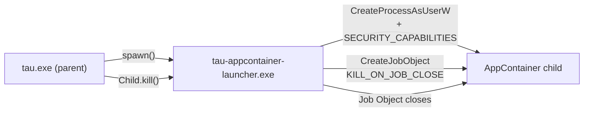

# ADR-0067: Windows AppContainer adapter — Phase 2 (Strict-tier enforcement)

**Status:** Accepted
**Date:** 2026-08-21
**Deciders:** Titouan Lebocq
**Related:** [ADR-0023 — Windows AppContainer scaffold (Phase 1)](0023-sandbox-windows-scaffold.md), [ADR-0014 — Sandboxing](0014-sandboxing.md), [ADR-0022 — macOS sandbox-exec adapter](0022-sandbox-darwin.md), [ADR-0062 — Process-gate port](0062-process-gate-port.md)

## Context

ADR-0023 shipped `crates/tau-sandbox-windows` as a Phase-1 scaffold: pure
profile translation (`build_appcontainer_caps`) shipped and tested, but
`acl.rs` was Win32-shaped stubs, `wrap_spawn` was a no-op, and the probe
returned `Unavailable` on Windows unconditionally. It named three coupled
Phase-2 blockers:

1. `tau-sandbox-proxy::spawn_proxy` is `cfg(unix)` (`UnixListener`) — no
   Windows transport for the HTTP egress proxy.
2. `std::process::Command` on Windows has no `pre_exec`; attaching
   `PROC_THREAD_ATTRIBUTE_SECURITY_CAPABILITIES` to a child process requires
   calling `CreateProcessAsUserW` directly.
3. `acl.rs` had no real Win32 ACL calls.

Full spec: `docs/superpowers/specs/2026-08-09-sandbox-windows-appcontainer-phase2-design.md`.

This EPIC resolves (2) and (3) and **explicitly defers (1)** — see "Network
egress: deferred" below. It also forces two peripheral flips: the
runtime process-gate registry's platform set for the `Native` adapter, and
the `windows-native-strict` target-triple status.

### Why flipping the probe first would have been a security lie

A real (non-dry-run) `tau install` resolves a Strict-tier sandbox adapter
(`resolve_adapter(SandboxRequirements::default())`). Before this EPIC, every
registry candidate was rejected on Windows, so the 10 install-path Tier-2
tests gated with `#[cfg_attr(windows, ignore = "…Phase-2 stub")]` failed
their setup step. Flipping only the probe (no real enforcement) would have
made these 10 tests pass, **but** it would also make a real
`kind = "rust-cargo"` install resolve a "Strict" adapter, pass the
fail-closed cross-check gate, and run untrusted `build.rs` **unsandboxed**
— reintroducing the exact RCE the install-build sandbox
(`2026-06-12-install-build-sandbox-design.md`) closes on Linux/macOS.

Therefore this EPIC's completion bar is **truthful enforcement, proven by
Windows integration tests, before the probe is flipped.** The 10 tests are
a trailing side-effect of the probe/registry flips, not the goal.

## Decision

### Enforcement model: Camp-2 exec-wrapper, not a Chromium-style broker

tau is already a "set kernel-enforced policy, then exec the target and step
back" system on every platform: Linux (landlock + seccomp via `pre_exec`),
macOS (`sandbox-exec` wrapper binary), egress (`tau-net-bridge` wrapper
binary). tau runs **no IPC broker and does no syscall brokering anywhere**.
The Windows adapter follows the same philosophy.

We considered the Chromium/Firefox sandbox model — a privileged broker
process that intercepts and adjudicates syscalls from a restricted-token
child — and rejected it for this adapter:

- AppContainer is a **kernel-enforced capability/ACL model**; access checks
  happen in the NT kernel against the process token, not via an
  interposed broker. It does not require one to function.
- A broker means an always-running privileged parent process, an IPC
  channel to secure, and per-syscall policy logic to write and maintain —
  exactly the class of complexity tau has avoided on every other platform.
- The broker earns its keep in Chromium/Firefox because it also *tightens*
  restricted tokens and integrity levels beyond what AppContainer alone
  provides (interception of window-manager calls, GPU driver calls, etc).
  tau doesn't need that extra tightening: AppContainer's FS ACL + process
  isolation model is already the Strict envelope from a plugin's
  perspective.

Concretely: `wrap_spawn` creates a uniquely-named AppContainer profile
(`tau-sbx-<pid>-<counter>`), derives its SID, and grants FS ACLs to that SID
on the plan's read/write paths (merged into the existing DACL, not
replacing it — a real ACL-merge bug found and fixed during this EPIC). The
returned `CapabilityHandle::Drop` revokes the ACLs (reverse order) and
deletes the profile — leak-safe, identical to the darwin/native lifetime
pattern.

### Launcher: a stateless exec-wrapper binary, not `CreateProcessAsUserW` inline

`Command::spawn()` gives back a `tokio::process::Child` with wired-up async
stdin/stdout/stderr and `id()`/`wait()`/`kill()`. Raw `CreateProcessAsUserW`
gives back a bare OS `HANDLE` — there is no public way in std/tokio to turn
a raw `HANDLE` into a `Child`. Calling it inside the adapter would force
reimplementing `Child` (pipes via `CreatePipe`, wait via
`WaitForSingleObject`, kill via `TerminateProcess`) and refactoring the
shared spawn path across every call site (`plugin_host::process`, the MCP
`transport_stdio` spawn site, the install path).

Instead, `tau-appcontainer-launcher.exe` — a ~150-line stateless exe —
performs the `CreateProcessAsUserW` dance. `wrap_spawn` rebuilds the
`&mut std::process::Command` in place (the same idiom the darwin adapter
uses): `*cmd = Command::new(launcher_path); cmd.arg(...)...`, prepending
the launcher so the real program runs *through* it. Every existing spawn
site keeps calling `command.spawn()` unchanged and receives a normal
`tokio::process::Child` (the launcher process). This mirrors the existing
`tau-net-bridge` helper shape exactly.

Ownership split: the **adapter** owns everything that must be cleaned up
(profile + ACLs, via `CapabilityHandle::Drop`); the **launcher** is
stateless, so a launcher crash cannot leak ACL grants. Kill propagation:
`plugin_host` kills the launcher, its Job Object closes, and
`KILL_ON_JOB_CLOSE` kills the AppContainer child — no orphans.

### Network egress: deferred, fail-closed

AppContainer processes are **blocked from loopback (`127.0.0.1`) by
default**. The only exemption, `CheckNetIsolation LoopbackExempt`, is
Microsoft-documented as *for development purposes only*: it is machine-global
mutable state keyed by AppContainer SID, requires admin, is racy across
concurrent installs, and grants the container *all* loopback traffic, not
just our proxy's. tau's egress proxy listens on `127.0.0.1:8443`, so the
"proxy on loopback" model used on Linux/macOS is not viable in production on
Windows as-is. A named-pipe alternative is circular: `reqwest` speaks TCP
`CONNECT` via `HTTPS_PROXY`, not named pipes, so bridging back to loopback
hits the same wall (the **AppContainer-loopback finding**).

Decision: the Phase-2 adapter enforces **filesystem + process isolation
only** and fails closed on network:

- `supported_shapes()` drops `NetworkHttp` (keeps `FilesystemRead`,
  `FilesystemWrite`, `ProcessExec`).
- `wrap_spawn` refuses any plan carrying an HTTP capability with a typed
  `CapabilityError`, rather than silently granting or silently dropping it.

This is honest: it enforces a real Strict FS/exec envelope and fails closed
on network rather than lying about coverage it doesn't have — consistent
with tau's fail-closed principle (ADR-0014). Consequence: real
`kind = "rust-cargo"` installs (whose `build_envelope` always includes
registry network hosts) fail closed on Windows and fall back to
`--allow-unsandboxed-build` until the egress follow-on lands. The 10
un-gated tests are unaffected — their fixture is a `kind = "tool"` package
with no `[plugin]` table, so `build_plugin_if_needed` returns `None`, the
cross-check is skipped, and `gate.wrap()` is never called. The adapter is
only *resolved* by these tests, never *used*.

Positive FS-path grant reachability is also deferred alongside network: an
AppContainer needs `FILE_TRAVERSE` on every ancestor directory to reach a
nested granted path, and the Phase-2 adapter ACLs only the leaf path. Grants
still isolate correctly (deny-by-default — a sibling directory without a
grant stays unreadable, proven by the FS-enforcement integration test), but
don't yet make every arbitrary granted path readable end-to-end. Ancestor
FILE_TRAVERSE grants are deferred to the same egress follow-on, where real
`cargo` builds first exercise positive FS reads under this adapter.

**Follow-on EPIC (out of scope here, referenced for tracking):** *Windows
sandbox network egress* — solve the loopback-exemption-vs-named-pipe
problem, add a TCP/named-pipe transport to `tau-sandbox-proxy`, restore
`NetworkHttp` to `supported_shapes`, add ancestor-traverse FS grants, and
un-defer net for real `rust-cargo` builds on Windows.

### The 3-PR phasing

The EPIC shipped as three independently-green PRs, deliberately ordered so
enforcement and its proof land before the probe (the truthfulness gate
above) flips:

| PR | Content | Probe state |
|---|---|---|
| 1 | `tau-appcontainer-launcher.exe` standalone binary + its own integration test (spawn a probe under an AppContainer, assert isolation). No runtime wiring. | `Unavailable` |
| 2 | Real `acl.rs` (Win32 ACL grant/revoke, merged into the existing DACL); `wrap_spawn` does FS ACLs + prepends the launcher + refuses HTTP plans; `supported_shapes` drops `NetworkHttp`; `strict_integration.rs` enforcement proof; `tier2.yml` Windows job gains `--features integration-tests`. Adapter is fully functional but the probe still declines, so production behavior on Windows is unchanged — this is the safety valve. | `Unavailable` |
| 3 (this ADR) | `probe → Available { tier: Strict }`; process-gate registry `Native` platform set gains Windows; `windows-native-strict` target-triple `Reserved → Available`; the 10 gated tests un-gated. | `Available { tier: Strict }` |

### Registry + target-triple flips forced by graduation

- `crates/tau-runtime-tokio/src/process_gate/registry.rs`: the `Native`
  adapter registration's `platforms` field changes from
  `PlatformSet::LinuxAndDarwin` to `PlatformSet::Multi` (which already meant
  "linux + macos + windows" — it was introduced for the `Container` adapter
  and is reused here rather than adding a new variant). This is what makes
  `resolve_adapter`/`registration_for_triple` route Windows to
  `WindowsSandbox` instead of finding no match.
- `crates/tau-ports/src/target/registry.rs`: `windows-native-strict` status
  changes from `Reserved { reason: "…" }` to `Available`. This closes the
  `host()` divergence gap tracked since ADR-0034 (target triple registry):
  `TargetTriple::host()` on Windows returns `windows-native-strict`, and
  before this flip that triple was in the registry but not `Available`, so
  `tau build` (default target = `host()`) and `tau build --target
  windows-native-strict` disagreed about whether the same triple could be
  built. After this flip they agree.

## Consequences

Positive:

- Windows gains a truthful Strict-tier sandbox adapter enforcing real
  filesystem and process isolation, proven by its own integration tests
  before the probe ever claims availability.
- The 10 previously-gated Tier-2 install-path tests
  (`cmd_install.rs` ×2, `cmd_list.rs` ×2, `cmd_uninstall.rs` ×2,
  `cmd_update.rs` ×4) now run on Windows CI.
- The `host()` / `--target windows-native-strict` divergence gap closes:
  default `tau build` and an explicit `--target windows-native-strict`
  agree on Windows.
- The launcher pattern is proven a third time (after macOS `sandbox-exec`
  and `tau-net-bridge`), reinforcing tau's "no in-process broker, ever"
  shape as the house style for platform-specific enforcement.

Negative:

- Real `rust-cargo` installs still do not run sandboxed on Windows in this
  EPIC — every such install carries a network capability, which this
  adapter fails closed on. Users need `--allow-unsandboxed-build` until the
  egress follow-on lands. This is a known, documented gap, not a silent one.
- FS-grant reachability is deny-by-default-correct but not yet
  fully-permissive-correct for deeply nested paths (missing ancestor
  `FILE_TRAVERSE`), deferred to the same follow-on.
- CI-only iteration continues to apply to future Windows sandbox work
  (~5–7 min per `windows-latest` cycle; no local AppContainer without a
  Windows dev environment).

New obligations this decision creates:

- A follow-on EPIC (network egress: loopback/named-pipe transport,
  `NetworkHttp` restoration, ancestor FS grants) must exist before Windows
  `rust-cargo` installs can run sandboxed.
- `docs/decisions/0023-sandbox-windows-scaffold.md`'s status line is updated
  to point here for its Phase 2 portion (this ADR).

## Alternatives considered

- **Chromium/Firefox-style broker process.** Rejected: AppContainer's
  kernel-enforced ACL model doesn't require a broker to work at all, and
  the broker's real value in browsers (intercepting and rewriting
  restricted-token syscalls beyond what AppContainer itself blocks) isn't
  something tau's threat model for a Strict sandbox tier needs. Adding one
  would mean a privileged always-on parent process and a new IPC surface —
  the exact shape tau has avoided on Linux and macOS.
- **Calling `CreateProcessAsUserW` directly inside the adapter (no
  launcher).** Rejected: the raw `HANDLE` it returns cannot be turned into
  a `tokio::process::Child` via any public API, so every spawn call site
  across the codebase (`plugin_host::process`, MCP stdio transport, the
  install path) would need adapter-aware branching. The stateless launcher
  keeps the existing `wrap_spawn(&mut Command) -> spawn()` contract intact
  everywhere else.
- **Loopback exemption (`CheckNetIsolation LoopbackExempt`) for network
  egress.** Rejected outright, not just deferred: Microsoft documents it as
  dev-only, it's racy machine-global state requiring admin, and it grants
  the AppContainer *all* loopback traffic rather than scoping it to tau's
  proxy port.
- **Flipping the probe in the same PR as the registry/target-triple
  changes but before real enforcement (PR2).** Rejected: this is exactly
  the "10 tests go green for free, but a real cargo build now runs
  unsandboxed" trap identified during design — it would have made the
  probe lie about what the adapter actually protects.
- **New `PlatformSet` variant instead of reusing `Multi` for the registry
  flip.** Rejected: `Multi` already means "linux + macos + windows" (it
  predates this EPIC, used by the `Container` adapter registration), so
  adding a new variant with identical semantics would just be duplication.

## References

- Spec: `docs/superpowers/specs/2026-08-09-sandbox-windows-appcontainer-phase2-design.md`
- Supersedes (Phase 2 of): [ADR-0023 — Windows AppContainer scaffold](0023-sandbox-windows-scaffold.md)
- Follow-on (network egress, not yet filed as its own ADR): tracked in the
  spec above under "Network egress: deferred" and "Out of scope"
