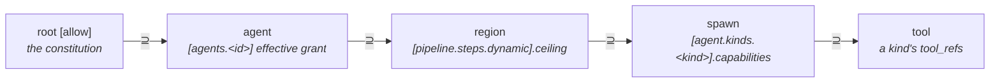

# Dynamic regions

A **dynamic region** is a pipeline step whose exact set of spawned
agents isn't known until runtime — a fan-out over search results, a
crawl frontier, a worker pool sized by input. Unlike a `Branch` or a
`Parallel` (both statically enumerated at authoring time), a dynamic
region *spawns per-kind agents on demand*, bounded by a build-time
envelope tau checks before the workflow ever runs, and gated again at
runtime when spawns actually happen (EPIC 4.5).

This page explains the capability lattice a dynamic region sits in,
the `tau.toml` authoring syntax, the build-time check that enforces
the envelope (EPIC 4.4, ADR-0024), and how the region actually
executes (EPIC 4.5). It assumes you've read
[Capabilities and consent](capabilities-and-consent.md) and
[Multi-agent orchestration](multi-agent-orchestration.md).

## The lattice

Every capability grant in tau narrows as it flows outward to inward.
Dynamic regions add two links to that chain: the **region** (the
bounded envelope a `[pipeline.steps.dynamic]` block declares) and the
**spawn** (the per-kind agent actually spawned inside it).



Read the arrows as "must be a superset of": the root `[allow]`
ceiling bounds every agent's effective grant, an agent's effective
grant bounds any region it owns, a region's own ceiling bounds every
kind it's allowed to spawn, and a spawned kind's capabilities bound
the tools it can reach. Each link narrows or stays equal — it never
widens moving outward to inward. A region's `agent` (its owning
coordinator) is **required** — every dynamic region is owned by a
named `[agents.<id>]` entry; there is no root-owned form.

The spawn *permission* itself — an agent's `agent.spawn { allowed_kinds
}` (or `skill.spawn`) capability — is **ceiling-exempt**. Root `[allow]`
structurally cannot list `agent.spawn` as a ceiling entry (it "flows
through the lattice's spawn link, not a raw ceiling entry"), so the L1
check (package manifest ⊆ root) *excludes* spawn caps rather than
demanding a matching ceiling key that can never exist. Bounding happens
one link inward instead: the spawn link (L3) requires each spawned
kind's capabilities ⊆ the agent's effective grant, and the agent's
*non-spawn* effective grant is already ⊆ root via L1 — so a spawned kind
stays transitively bounded by root. `Custom`/`Forward` caps are not
spawn caps and remain subject to L1's deny-by-default ceiling.

## Per-kind agent definitions

A dynamic region doesn't spawn `[agents.<id>]` entries (those are
fixed, named agents wired into the pipeline at authoring time). It
spawns **kinds** — reusable agent templates declared once and
instantiated by name, any number of times, at runtime:

```toml
[agent.kinds.researcher]
description  = "Researches a single sub-question and reports back."
prompt       = "You are a focused researcher. Investigate the given question."
model        = "fast"
tools        = ["web_search"]
capabilities = { "net.http" = { hosts = ["api.crawler.test"] } }
```

- `capabilities` uses the same inline-table map grammar as `[allow]`
  and `[tools.<id>]` — one entry per capability kind, keyed by the
  kind's dotted name (`"net.http"`, `"fs.read"`, …), each value shaped
  per that kind's fields.
- `description` — optional, LLM-visible. It becomes the tool
  description the coordinator's LLM sees for `agent.<kind>.spawn`
  (see [Runtime execution](#runtime-execution-epic-45) below).
- `prompt` — **required** for any kind a region actually offers. The
  child agent's system prompt when this kind is spawned.
- `model` — **required**. A `[models]` alias (see
  [Multi-agent orchestration](multi-agent-orchestration.md)),
  resolved at lowering.
- `tools` — optional. Ids from `[tools.*]` the spawned child may call,
  bounded by `capabilities` the same way any agent's tool access is.

## Authoring a dynamic region

```toml
[[pipeline.steps]]
id = "fanout"

[pipeline.steps.dynamic]
agent           = "coordinator"   # required: names the owning agent (see lattice above)
spawns          = ["researcher"]  # optional: omitted = the whole [agent.kinds.*] store
ceiling         = { "net.http" = { hosts = ["api.crawler.test"] } }
max_spawns      = 8
max_concurrency = 4
```

- `agent` — **required**. Names the `[agents.<id>]` entry that owns
  and runs as the region's coordinator; its effective grant becomes
  the region's L4a bound.
- `spawns` — **optional**. The kind names this region may instantiate.
  Each must have a matching `[agent.kinds.<name>]`. Omitted ⇒ every
  kind in the `[agent.kinds.*]` store is offered to the coordinator.
  Either way, `tau build` fails loudly (`spawn_exceeds_region`) if any
  offered kind's capabilities exceed the region's own `ceiling`, and a
  region that resolves to zero spawnable kinds is an authoring error.
- `ceiling` — the region's own capability envelope, in the same
  inline-table map grammar. Bounds every kind the region offers.
- `max_spawns` — the hard cap on total agents this region may spawn
  across its lifetime (must be ≥ 1).
- `max_concurrency` — the hard cap on agents running at once inside
  the region (must be ≥ 1, ≤ `max_spawns`).

Lowered, a dynamic region becomes a `StepRun::Dynamic` node in the
workflow IR (`ir_format` v2.7.0+) — see
[Workflows](workflows.md) for how pipeline steps generally lower.

## The build-time check

Like every other governance rule in tau, the dynamic-region lattice
is enforced at **build time** (`tau check` / `tau build`), not
deferred to a runtime gate — see
[the three-gate guarantee](three-gate-guarantee.md). Four rule ids
cover the lattice's two lower links:

| Rule id | Lattice link | Fires when |
|---|---|---|
| `tau.governance.spawn_exceeds_agent` | agent ⊇ spawn (L3) | An agent's own `agent.spawn { allowed_kinds }` grant lists a kind whose `[agent.kinds.<kind>]` capabilities exceed that agent's effective grant. |
| `tau.governance.unknown_spawn_kind` | agent ⊇ spawn (L3) / region ⊇ spawn (L4b) | An agent or a region lists a spawn kind with no matching `[agent.kinds.<kind>]` definition. |
| `tau.governance.region_exceeds_ceiling` | region ⊆ owner (L4a) | A region's `ceiling` exceeds its owning agent's (`agent`, required) effective grant. |
| `tau.governance.spawn_exceeds_region` | region ⊇ spawn (L4b) | A kind the region offers — via `spawns`, or the whole `[agent.kinds.*]` store when `spawns` is omitted — has capabilities exceeding that region's own `ceiling`. |

All four are `Severity::Error` — a violation fails `tau check`
(exit 2) and blocks `tau build`. There is no advisory/Note tier for
this lattice: the design promotes what was, before EPIC 4.4, a
runtime-deferred transparency Note (`spawn_runtime_enforced`) into a
real build-time gate.

## Runtime execution (EPIC 4.5)

At runtime a dynamic region runs its owning **coordinator** agent
(`agent = "..."`, required). Every kind the region offers appears in
the coordinator's tool list as `agent.<kind>.spawn` — an ordinary
tool (the same shape as a coding harness's subagent/Task tool),
described to the LLM by the kind's `description`. Spawning is a tool
call; the admission gate runs inside it:

1. **Membership** — by construction: only offered kinds are
   registered as tools.
2. **Bounds** — one pooled counter per region instance, shared across
   every kind: past `max_spawns`, the call is **soft-denied** — an
   error tool-result the coordinator sees and must adapt to (e.g.
   "spawn denied: region `fanout` max_spawns exhausted (8/8)"); the
   run does not abort. `max_concurrency` is guarded the same way
   (defensively — tau dispatches a turn's tool calls sequentially
   today).
3. **Attenuation** — the child's grant is `meet(region ceiling, kind
   capabilities)` — the sound lattice meet, computed at runtime — and
   enforced on every child tool call via `AttenuatedDispatcher`. This
   runtime clamp is what makes the build-time L1 spawn-cap deferral
   sound, including against hand-crafted IR.

Each admitted spawn runs the kind's own agent definition
(`prompt`/`model`/`tools`) as child `<region-step>:<kind>#<n>`; its
final text returns as the tool result. The region step's output is
the coordinator's final text.

If a check rewinds to a dynamic-region step as its gate, outstanding
rationales are injected into the coordinator's next run (labelled
prior turns), the same as an agent step.

Every gate action is observable: denials surface as ordinary error
`ToolCallCompleted` events in the run stream (no new `RunEvent`
variant), and as `runtime.dynamic.spawned` / `runtime.dynamic.spawn_denied`
/ `runtime.dynamic.attenuation_denied` `tracing` events, visible via
`RUST_LOG` or the OTLP layer. These are not currently surfaced as `tau
run --tui` drop rows — the IR interpreter path that runs dynamic
regions builds `RunOptions` with no orchestration channel wired, so it
emits none of the orchestration `TraceEvent`s the TUI renders — but a
bounded-out run is auditable without reading the coordinator's prose.

**wasm divergence (explicit):** dynamic regions are native-only. `tau
build --target wasm` rejects any workflow containing one at build
time (`FeatureUnsupported`), so the guest interpreter never sees a
region and carries no gate.

Conformance fixture `crates/tau-ir-conformance/fixtures/24_dynamic_region`
pins admit-one + soft-deny-the-next end-to-end.
