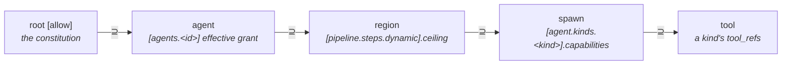

# Dynamic regions

A **dynamic region** is a pipeline step whose exact set of spawned
agents isn't known until runtime — a fan-out over search results, a
crawl frontier, a worker pool sized by input. Unlike a `Branch` or a
`Parallel` (both statically enumerated at authoring time), a dynamic
region *spawns per-kind agents on demand*, bounded by a build-time
envelope tau checks before the workflow ever runs.

This page explains the capability lattice a dynamic region sits in,
the `tau.toml` authoring syntax, and the build-time check that
enforces the envelope (EPIC 4.4, ADR-0024). It assumes you've read
[Capabilities and consent](capabilities-and-consent.md) and
[Multi-agent orchestration](multi-agent-orchestration.md).

## The lattice

Every capability grant in tau narrows as it flows outward to inward.
Dynamic regions add two links to that chain: the **region** (the
bounded envelope a `[pipeline.steps.dynamic]` block declares) and the
**spawn** (the per-kind agent actually spawned inside it).



Read the arrows as "must be a superset of": the root `[allow]`
ceiling bounds every agent's effective grant, an agent's effective
grant bounds any region it owns, a region's own ceiling bounds every
kind it's allowed to spawn, and a spawned kind's capabilities bound
the tools it can reach. Each link narrows or stays equal — it never
widens moving outward to inward. A region with no named owning agent
(`agent` omitted) is owned directly by the root `[allow]` ceiling.

## Per-kind agent definitions

A dynamic region doesn't spawn `[agents.<id>]` entries (those are
fixed, named agents wired into the pipeline at authoring time). It
spawns **kinds** — reusable capability templates declared once and
instantiated by name, any number of times, at runtime:

```toml
[agent.kinds.researcher]
capabilities = { "net.http" = { hosts = ["api.crawler.test"] } }
```

`capabilities` uses the same inline-table map grammar as `[allow]`
and `[tools.<id>]` — one entry per capability kind, keyed by the
kind's dotted name (`"net.http"`, `"fs.read"`, …), each value shaped
per that kind's fields.

## Authoring a dynamic region

```toml
[[pipeline.steps]]
id = "fanout"

[pipeline.steps.dynamic]
spawns          = ["researcher"]
ceiling         = { "net.http" = { hosts = ["api.crawler.test"] } }
max_spawns      = 8
max_concurrency = 4
# agent = "coordinator"   # optional: name the owning agent (see lattice above)
```

- `spawns` — the kind names this region may instantiate. Each must
  have a matching `[agent.kinds.<name>]`.
- `ceiling` — the region's own capability envelope, in the same
  inline-table map grammar. Bounds every kind listed in `spawns`.
- `max_spawns` — the hard cap on total agents this region may spawn
  across its lifetime (must be ≥ 1).
- `max_concurrency` — the hard cap on agents running at once inside
  the region (must be ≥ 1, ≤ `max_spawns`).
- `agent` — optional. Names the `[agents.<id>]` entry that owns this
  region (its effective grant becomes the region's L4a bound instead
  of the root `[allow]` ceiling).

Lowered, a dynamic region becomes a `StepRun::Dynamic` node in the
workflow IR (`ir_format` v2.6.0+) — see
[Workflows](workflows.md) for how pipeline steps generally lower.

## The build-time check

Like every other governance rule in tau, the dynamic-region lattice
is enforced at **build time** (`tau check` / `tau build`), not
deferred to a runtime gate — see
[the three-gate guarantee](three-gate-guarantee.md). Four rule ids
cover the lattice's two lower links:

| Rule id | Lattice link | Fires when |
|---|---|---|
| `tau.governance.spawn_exceeds_agent` | agent ⊇ spawn (L3) | An agent's own `agent.spawn { allowed_kinds }` grant lists a kind whose `[agent.kinds.<kind>]` capabilities exceed that agent's effective grant. |
| `tau.governance.unknown_spawn_kind` | agent ⊇ spawn (L3) / region ⊇ spawn (L4b) | An agent or a region lists a spawn kind with no matching `[agent.kinds.<kind>]` definition. |
| `tau.governance.region_exceeds_ceiling` | region ⊆ owner (L4a) | A region's `ceiling` exceeds its owning agent's effective grant (or the root `[allow]` ceiling, when `agent` is omitted). |
| `tau.governance.spawn_exceeds_region` | region ⊇ spawn (L4b) | A kind listed in a region's `spawns` has capabilities exceeding that region's own `ceiling`. |

All four are `Severity::Error` — a violation fails `tau check`
(exit 2) and blocks `tau build`. There is no advisory/Note tier for
this lattice: the design promotes what was, before EPIC 4.4, a
runtime-deferred transparency Note (`spawn_runtime_enforced`) into a
real build-time gate.

## Runtime execution

Actually *executing* a dynamic region — spawning kinds at runtime,
tracking `max_concurrency`, joining results — lands in **EPIC 4.5**.
Today the interpreter recognizes a `StepRun::Dynamic` node but refuses
to run it (`RuntimeError::DynamicRegionRequiresRuntimeGate`); the
build-time lattice above is enforced regardless, so an over-reaching
region is caught before it ever reaches that guard.
