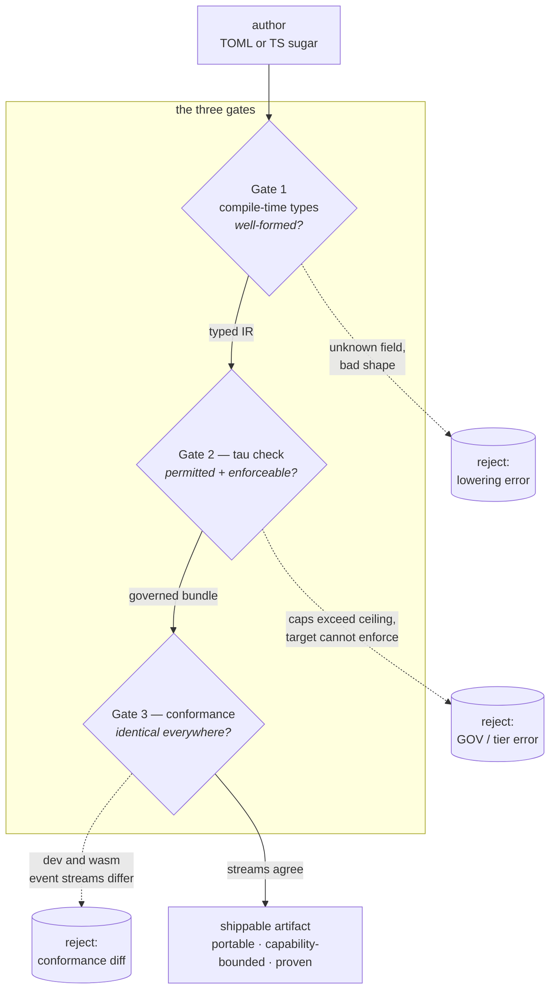

# The three-gate guarantee

tau's wedge — declare an agent once and get *a portable, capability-bounded
component proven identical across local / edge / browser / embedded, with
build-time enforcement and no runtime surprises* (see
[the philosophy](tau-philosophy.md#the-wedge)) — is not one check. It is three
independent gates, each proving a property the other two cannot:

| Gate | The question it answers | When it runs |
|---|---|---|
| **1 — Compile-time types** | Is the workflow *well-formed*? | authoring / lowering |
| **2 — `tau check`** | Is it *permitted, and can the target enforce it*? | build |
| **3 — Conformance** | Does it *behave identically on every target*? | post-build / CI |

None of the three subsumes another. Types cannot know your `[allow]` ceiling;
`tau check` cannot prove two compiled artifacts emit the same event stream;
conformance runs too late to be the place you learn a field name was
misspelled. A workflow earns the wedge's promise only by passing all three,
and each gate is designed to catch the class of error the previous one lets
through by construction.

## Gate 1 — compile-time types: is it well-formed?

The first gate is the type system, exercised the moment a workflow is lowered
to the [workflow IR](../decisions/0037-workflow-ir.md). The IR is a *typed*
model, not a bag of strings, and lowering is strict:

- **Unknown inputs are rejected, not ignored.** A misspelled field, an
  unrecognised `kind`, or a stray key fails lowering rather than being
  silently dropped — the strict-authoring surface of
  [ADR-0061](../decisions/0061-build-links-verified-linkrecord.md). Authoring
  mistakes surface as errors at the earliest possible moment.
- **Capabilities are typed shapes.** `fs.read paths=[…]`,
  `net.http hosts=[…]`, `process.spawn commands=[…]` are typed variants with
  serde-level evolution rules ([ADR-0002](../decisions/0002-manifest-format.md)),
  so a capability cannot be conjured by a malformed manifest. See
  [Capabilities and consent](capabilities-and-consent.md#what-a-capability-is).
- **The TS sugar layer is type-checked and lowers to the same IR.** The
  TypeScript authoring surface is sugar over the IR, not a parallel runtime;
  it type-checks at author time and emits the byte-identical IR the TOML
  surface produces
  ([ADR-0041](../decisions/0041-ts-authoring-declarations-only.md)).

This gate is analogous to `rustc`'s type check: it proves the program *has a
meaning*, and nothing more. It cannot know whether your project *permits* the
capabilities the workflow requires — that is a policy question the types have
no view of. That is Gate 2.

## Gate 2 — `tau check`: is it permitted, and can the target enforce it?

The second gate is [`tau check`](../../ROADMAP.md) (shipped as Phase 2 §A,
PR #161) — tau's build-time enforcement stance made concrete. tau's rule is
Rust-like: *any check that could run at build time must run at build time;
deferring it to runtime is a regression.* Where the types prove shape, `tau
check` proves policy and enforceability:

- **The governance ceiling.** Every capability, model alias, MCP server and
  tool an agent resolves to must fall inside the project's `[allow]`
  constitution ([ADR-0057](../decisions/0057-root-allow-governance.md)). A
  project with no `[allow]` section is a hard error (`GOV000`, exit 2) unless
  it opts out explicitly with `--allow-ungoverned`. See
  [Governed by default](capabilities-and-consent.md#governed-by-default).
- **Capability-subset validation.** A project override may only *narrow* a
  package's declared capabilities; an override that expands them fails
  validation (`CapabilityOverrideExpands`). The granted set the runtime sees
  is always a subset of what the user consented to.
- **The target can actually enforce it.** `tau check --target` refuses to
  build a workflow that demands enforcement a target cannot provide. A
  workflow that requires the `strict` sandbox tier cannot ship as
  `passthrough` without an explicit declaration — the capability-safety
  conviction of [the philosophy](tau-philosophy.md#three-convictions) turned
  into a gate. See [Sandboxing](sandboxing.md) and the
  [target-triple registry](../reference/target-triples.md)
  ([ADR-0034](../decisions/0034-target-triple-registry.md)).

The built bundle records the governance outcome in a `[governance]` record
(`governed` / `ungoverned` / `skipped`) hashed into the bundle self-hash, so a
verdict cannot be rewritten after the fact, and running an `ungoverned` bundle
re-triggers the gate. `tau check` proves the workflow is *allowed to exist on
this target* — but it says nothing about whether the compiled artifact will
*behave* the same as the interpreted one. That is Gate 3.

## Gate 3 — conformance: does it behave identically everywhere?

The third gate is the
[cross-target conformance gate](../decisions/0048-cross-target-conformance-gate.md)
([ADR-0048](../decisions/0048-cross-target-conformance-gate.md), refined by
[ADR-0049](../decisions/0049-single-channel-typed-conformance-observable.md)).
It is the behavioral sibling of `tau verify --bundle`'s byte-level
reproducibility check, and it is what lets tau claim *no dev/prod drift*.

The gate runs the canonical scenario under two execution profiles — the
interpreted `tau dev` engine and the compiled wasm artifact — and demands
their observable behavior agree:

- **The comparison is a typed, versioned event stream.** Each profile emits an
  ordered `ConformanceEvent` stream (carrying `CONFORMANCE_EVENT_VERSION`); the
  gate normalizes away timestamps, run/agent ids and provider tool-call ids,
  then diffs event kind + ordering, tool name + args + result, context-step
  token counts, inference stop-reason, and run outcome.
- **Ordering is causal by construction.** The dev profile drives the engine's
  streaming generator with a tracing captor installed; because the executor is
  single-threaded, everything emitted between two yields belongs to that step,
  so the interleave is causal with no timestamp heuristics — directly avoiding
  the flakiness a merge-by-timestamp gate would reintroduce.
- **Two assertions.** `dev == golden` (a blessed golden file — the stable,
  crate-owned contract) and `dev == wasm` (cross-profile parity).

> **Implementation status.** Of those two assertions, only `dev == golden`
> currently runs. `dev == wasm` is `#[ignore]`d because `WasmProfile` is
> still a stub (`crates/tau-conformance/src/profile/wasm.rs`), so
> cross-profile parity is **described by this gate but not yet asserted by a
> running test**. Everything below describes the gate's design contract, not
> today's enforcement. Tracked in
> [#691](https://github.com/tau-rs/tau/issues/691); see
> [Testing strategy](testing-strategy.md#caveat-g3s-cross-profile-assertion-is-not-yet-live).
>
> The live `dev == golden` leg runs in Tier 0 (`test-stable / linux`, every
> PR) and in the Tier 2 job `conformance / linux`, which is non-blocking for
> merge.

This is the gate that proves the philosophy holds: *the same engine, the same
IR, exercised both ways, must produce the same behavior.* Types and `tau
check` are both static — they reason about the program without running it.
Conformance is the only gate that runs the program, on more than one target,
and insists the results match.

## Why three, and not one

Each gate is a filter over a distinct class of error, ordered cheapest-first:

| Error class | Caught by | Why the earlier gates miss it |
|---|---|---|
| Misspelled field, wrong `kind`, malformed capability shape | Gate 1 (types) | — (this is the first gate) |
| Capability outside the `[allow]` ceiling; override that expands grants | Gate 2 (`tau check`) | Types don't know the project's constitution. |
| `strict`-tier workflow targeting a `passthrough`-only target | Gate 2 (`tau check`) | A well-typed workflow can still demand enforcement a target lacks. |
| Compiled artifact drifts from the interpreted one at runtime | Gate 3 (conformance) | Both static gates reason without executing; drift only appears when you run both profiles. |

The layering is deliberate. A cheap static gate (types) rejects the largest
class of mistakes at author time, before anything is built. A build-time gate
(`tau check`) rejects everything that depends on project policy and target
capability, before an artifact ships. Only the residue — behavioral divergence
between profiles, which is invisible to any static analysis — reaches the
expensive gate that actually runs the workflow twice. Pushing each check to
the earliest gate that can catch it is the whole discipline: the further left
a mistake is caught, the cheaper it is, and the fewer runtime surprises
survive to the artifact.

## See also

- [The tau philosophy](tau-philosophy.md) — the three convictions and the
  wedge these gates enforce.
- [Capabilities and consent](capabilities-and-consent.md) — the declared /
  granted / allowed model Gates 1 and 2 operate over.
- [Sandboxing](sandboxing.md) — the four-layer enforcement model behind Gate 2.
- [Testing strategy](testing-strategy.md) — where the tests for each gate live.
- [Target-triple reference](../reference/target-triples.md) — what a target can
  enforce, which Gate 2 checks against.
- [ADR-0057](../decisions/0057-root-allow-governance.md) — root `[allow]`
  governance + build-time enforcement (Gate 2).
- [ADR-0048](../decisions/0048-cross-target-conformance-gate.md) /
  [ADR-0049](../decisions/0049-single-channel-typed-conformance-observable.md)
  — the conformance contract (Gate 3).
