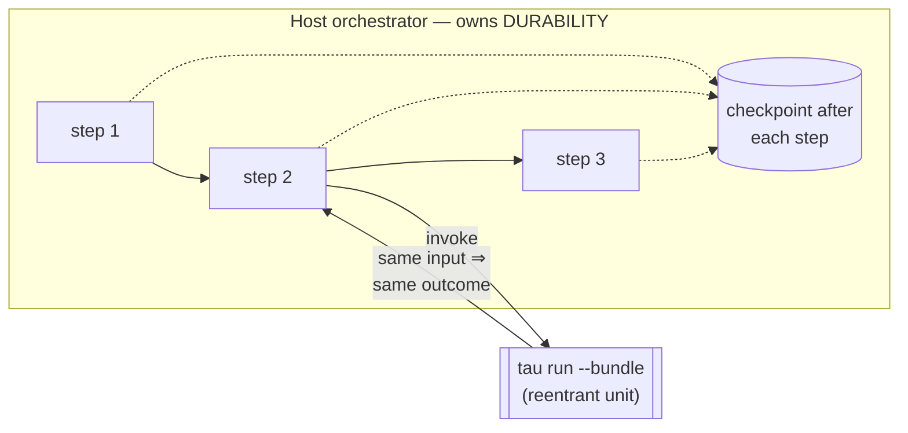

# Run tau under a durable orchestrator

You have a long-running or failure-prone process — a fan-out across many
inputs, a step that calls flaky external services, a pipeline that must
survive a worker crash — and you want **durable execution**: if a step
dies, it retries from where it left off, and a completed step is never
re-run.

tau does not provide that itself. tau is a workflow *compiler and
runtime*, not a general-purpose durable-execution engine (see
[non-goal NG5](../../ROADMAP.md)). Instead, tau makes its compiled
artifact a clean unit to hand to an orchestrator that *does* own
durability — Temporal, Inngest, DBOS, Restate, or Cloudflare Workflows.

This guide states the contract that makes that safe, then shows the
integration shape for three common orchestrators.

## The contract: a tau bundle is a safe-to-retry reentrant unit

> A `tau run --bundle <bundle> <input>` invocation is a pure function of
> `(bundle_hash, input)`. Durability — *when* and *whether* to re-run —
> is owned by the host orchestrator. tau guarantees the artifact is a
> **reentrant** unit: invoking it again with the same input produces the
> same observable outcome.

Two properties back this up, each independently tested:

| Property | What it means | Where it is proven |
|---|---|---|
| **Content-addressed** | A bundle's identity *is* its content. Building the same source twice yields the same `bundle.sha256`; tampering is detected. | `tau verify --bundle` / `tau_pkg::bundle::reproduce` (`reproducible_when_tree_unchanged`, `verify_self_hash`) |
| **Reentrant** | Invoking the same bundle with the same input twice yields an identical observable outcome (same result + same side-effect multiset). | `tau-ir-conformance` (`bundle_invocation_is_reentrant_multi_turn`) |

Because the bundle is content-addressed, the orchestrator can use
`bundle_hash` as a stable cache/idempotency key. Because invocation is
reentrant, the orchestrator's retry policy is safe: a retried step
recomputes the same answer rather than diverging.



The orchestrator checkpoints *between* bundle invocations and decides
when to retry; tau guarantees each invocation is a safe-to-retry pure
function. The two concerns compose cleanly.

## Integration shape

In every orchestrator the pattern is the same: wrap `tau run --bundle`
as the orchestrator's unit of retryable work (an "activity" / "step"),
give it a retry policy, and let the orchestrator persist progress
between calls.

### Temporal (Python)

```python
from datetime import timedelta
from temporalio import workflow, activity
from temporalio.common import RetryPolicy

@activity.defn
async def run_tau_bundle(bundle: str, step_input: dict) -> dict:
    # tau run --bundle is the reentrant unit; Temporal owns the retry.
    return await invoke_subprocess(["tau", "run", "--bundle", bundle,
                                    "--input", json.dumps(step_input)])

@workflow.defn
class FanMonitor:
    @workflow.run
    async def run(self, plan: list[dict]) -> None:
        for step in plan:                       # Temporal checkpoints each step
            await workflow.execute_activity(
                run_tau_bundle,
                args=["fan-monitor.tau", step],
                retry_policy=RetryPolicy(maximum_attempts=5),
                start_to_close_timeout=timedelta(minutes=10),
            )
```

If `run_tau_bundle` crashes on attempt 3, Temporal retries it; because
the bundle is reentrant, attempts produce the same observable outcome.
Steps that already completed are not re-run — Temporal replays its event
history past them.

### Inngest (TypeScript)

```ts
inngest.createFunction(
  { id: "fan-monitor", retries: 5 },
  { event: "fan/monitor.requested" },
  async ({ event, step }) => {
    for (const item of event.data.plan) {
      // step.run memoizes the result; a retry of the function re-enters
      // here and skips already-completed steps.
      await step.run(`tau-${item.id}`, () =>
        runTauBundle("fan-monitor.tau", item),
      );
    }
  },
);
```

### Cloudflare Workflows (TypeScript)

```ts
export class FanMonitor extends WorkflowEntrypoint<Env, Plan> {
  async run(event: WorkflowEvent<Plan>, step: WorkflowStep) {
    for (const item of event.payload.steps) {
      await step.do(
        `tau-${item.id}`,
        { retries: { limit: 5, delay: "10 seconds" } },
        () => runTauBundle("fan-monitor.tau", item),
      );
    }
  }
}
```

In all three, the orchestrator persists the result of each completed
`tau run --bundle` call and only retries the failing one. tau supplies
the reentrancy that makes those retries correct.

## Granularity caveat: durability is whole-bundle

The unit of durability under this model is the **whole bundle
invocation**. A single `tau run --bundle` that drives a long, multi-turn
agent loop is, to the orchestrator, *one* step:

- If it crashes at turn 9 of a 12-turn run, the orchestrator retries the
  whole invocation, which re-enters at turn 1 — re-billing the eight
  completed turns.
- The orchestrator cannot checkpoint *inside* the agent loop, because it
  only sees the bundle as an opaque retryable unit.

For coarse-grained pipelines — many short bundle invocations stitched
together by the orchestrator — this is exactly right, and it is the
recommended pattern today. For a *single* bundle with an expensive
intra-bundle loop, whole-bundle retry is wasteful. Closing that gap is
the job of tau's opt-in turn-level checkpoint/resume
(`[agent.<id>.durable]`), which composes with this model: the
orchestrator still owns *when* to retry, and tau's per-turn checkpoint
narrows *how much* re-runs on each retry. Until that ships, keep
per-invocation work bounded and side effects idempotent.

## Opt-in per-agent checkpointing (EPIC 6.1 — intent form)

For long-running agents that must survive a process restart *within* a
single bundle invocation, tau provides an opt-in intent knob. Instead of
declaring a full explicit checkpoint config, you give the agent a
high-level **intent** and tau picks the right granularity and store for
the run/build target:

**TOML:**

```toml
[agents.fan]
durable = "survive-restarts"
```

**TypeScript:**

```ts
export const fan = agent({
  durable: "survive-restarts",
});
```

The intent `"survive-restarts"` resolves per target. On targets that
support persistence (e.g. `linux-native-strict`) the runtime resolves it
to the coarsest granularity the target can durably provide; on targets
that do not support checkpointing the build is refused with a clear
diagnostic.

If you need fine-grained control (e.g. `per_tool_call` checkpoints to a
specific store), use the explicit sub-table form instead:

```toml
[agents.fan.durable]
checkpoint = "per_turn"
store = "file"
```

### Viewing the resolved durability

`tau check --target <triple>` prints the resolved durability for each
agent in the project, including which intent maps to which
granularity/store pair for the requested target. Run it before `tau
build` to verify the intent resolves as expected:

```
$ tau check --target linux-native-strict
...
[note] agent fan: durable survive-restarts → per_turn/file
```

If the target does not support durable execution, `tau check` emits an
`error`-level finding instead, and the build will be refused.

## See also

- The bundle format ([ADR-0035](../decisions/0035-bundle-format.md)) and
  `tau verify --bundle` — the content-addressing the reentrancy claim
  rests on.
- [Workflows](../explanation/workflows.md) — how tau compiles and runs
  workflow IR.
- [Roadmap, non-goal NG5](../../ROADMAP.md) — why tau delegates
  durability rather than building an engine.
