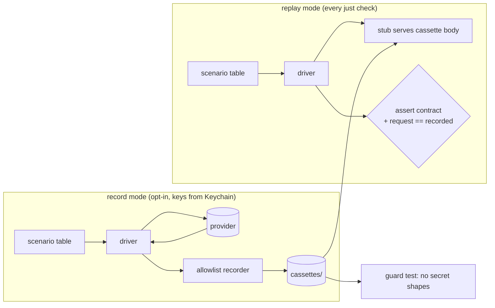

# Provider cassettes: record-and-replay for the model drivers

Issues: #100 (this lane), #101 (e2e offline), #102 (e2e live). Governs
`drivers/tests/`. Does not touch `kernel/src/abi/` or `tau_kernel::bridge`.

## In plain language

The two model drivers, Anthropic and OpenAI-compatible, are tested today
against a fake server that replays bodies we wrote by hand from the ADR-0006
provider-mapping table. Those tests prove the driver agrees with *our reading*
of the contract. They cannot prove the contract still agrees with the
provider, and #46 showed that gap: Anthropic started rejecting `temperature`
on newer models and nobody knew until a human ran a call.

A **cassette** is one real exchange with a provider, captured once, stripped
of credentials, and committed. The existing fake server replays it on every
`just check`. Re-recording the set is the drift check: if the provider moved,
the diff shows where. Think of a flight recorder: record once in the air,
replay endlessly on the ground.

Two tiers keep this cheap. The **full matrix** (every contract row and every
recordable failure mode) runs on one inexpensive model per provider, because
the driver's byte mapping is the same for every model of a provider. The
**capability probe** (three or four calls) runs on *every* model both
providers list, because what differs per model is a short list of policies:
does it take sampling, can thinking be disabled, which output-cap field does
it want. Those policies are exactly the driver's config knobs, so the probe
set is evidence for a per-model table the harness can rely on offline.



## Decisions

### 1. One scenario table, two modes

A **scenario** is: a name, a driver config (model, knobs), a bridge
`ModelRequest`, and an **expectation** the contract promises (stop reason,
content shape, error class, whether anything was sent). The same table drives:

- **record**: `#[ignore]`, enabled by `TAU_RECORD=1`; the driver is pointed at
  the real base URL through a local **capturing proxy** (the stub in
  pass-through mode) so the bytes on the wire are what gets written. The
  expectation is asserted. On success the cassette is written.
- **replay**: default; the stub answers with the cassette's status and body.
  The expectation is asserted, and additionally the request the driver sends
  now equals the cassette's request **in value**, exactly (§4 explains why
  nothing needs masking).

*Why*: one table means record and replay can never drift from each other,
and re-recording is the drift test rather than a separate canary.

*Rejected*: VCR-style interception inside `reqwest`. It would add test-only
hooks to the driver's public surface; the stub was built precisely so nothing
in the crate exists only for tests.

### 2. Cassette format

One JSON file per scenario per target, `drivers/tests/cassettes/<target>/<scenario>.json`,
where `<target>` is `anthropic`, `openai`, or `ollama`.

```json
{
  "v": 1,
  "recorded_at": "2026-09-15",
  "target": "anthropic",
  "model": "claude-haiku-4-5-20251001",
  "exchanges": [
    {
      "request": {
        "method": "POST",
        "path": "/v1/messages",
        "headers": { "content-type": "application/json", "anthropic-version": "2023-06-01" },
        "body": { "...": "the JSON the driver sent" }
      },
      "response": {
        "status": 200,
        "body": { "...": "the JSON the provider returned" }
      }
    }
  ]
}
```

A scenario is a list of **exchanges**, because several make more than one
HTTP call: a tool-result round trip is two calls, thinking replay is two,
and `count_tokens` mode is a count call followed by the message call. Replay
scripts the stub with the responses in order and checks the requests in order.

`model` is the id the *response* reported (OpenAI answers a dated id for an
alias), so a cassette names what actually answered; a rejected call has no
reply model, so the configured id is kept.

### 3. Allowlist recorder, not denylist redaction

The recorder copies request headers **only** from the set
`{content-type, anthropic-version, anthropic-beta}`. `authorization` and
`x-api-key` are never read. Response headers are dropped entirely: they carry
request ids and rate-limit state the driver does not use. If a captured
request carries any header outside the allowlist that is not in the known
transport set (`host`, `content-length`, `accept`, `user-agent`,
`accept-encoding`, `connection`), record mode **refuses to write** and fails
the scenario with the offending header name.

*Why*: a denylist has to be updated when a provider adds an auth header; an
allowlist cannot leak what it never reads.

### 4. What replay compares, and why nothing is masked

Replay compares every request body the driver sends with the recorded one
**exactly, in value**. No masking is needed: the driver receives the
recorded response, so a second-turn request carries the very tool-call ids
and thinking signatures the recording did. If a request diverges, the driver
moved, and the test is red for the right reason.

Replay compares the *reply* only through the contract expectation (stop
reason, tool-call names and count, usage present, error class). Provider ids,
`created`, `system_fingerprint`, dated model ids, and generated text are
never asserted. A **re-record** therefore produces a diff that is noisy in
those fields by design and informative in the rest; a reviewer reads it, and
the build does not go red on its own.

### 5. Guard test

A replay-suite test walks every file under `drivers/tests/cassettes/` and
fails if any of these appear anywhere in the file: `sk-ant-`, `sk-proj-`,
`sk-` followed by 20+ key characters, `Bearer `, or a request header name
outside the allowlist. It also fails if a cassette's `v` is unknown or its
`target` does not match its directory.

### 6. Two tiers

**Full matrix**, on Haiku 4.5, `gpt-4.1-mini`, and Ollama `qwen3:1.7b`:

| Scenario | Anthropic | OpenAI | Ollama |
|---|---|---|---|
| `text_end_turn` | ✓ | ✓ | ✓ |
| `tool_call` | ✓ | ✓ | ✓ |
| `tool_result_round_trip` (two turns) | ✓ | ✓ | ✓ |
| `parallel_tool_calls` | ✓ | ✓ | – |
| `max_tokens_stop` | ✓ | ✓ | ✓ |
| `stop_sequence_stop` (OpenAI reports it as `end_turn`, see below) | ✓ | ✓ | – |
| `sampling_accepted` | ✓ | ✓ | ✓ |
| `thinking_on_replayed_second_turn` | ✓ | n/a | n/a |
| `thinking_disabled` | ✓ | n/a | n/a |
| `count_tokens_estimate` | ✓ | n/a | n/a |
| `max_completion_tokens_cap` | n/a | ✓ | – |
| `bad_request_400` | ✓ | ✓ | ✓ |
| `bad_key_401` | ✓ | ✓ | n/a |
| `unknown_model_404` | ✓ | ✓ | ✓ |

**Capability probe**, on every model the provider's models endpoint lists at
record time (Anthropic: 11 today; OpenAI: chat-capable ids with dated
duplicates and `*-chat-latest` collapsed, about 30):

| Probe | Anthropic | OpenAI |
|---|---|---|
| `probe_text` | ✓ | ✓ |
| `probe_tool_call` | ✓ | ✓ |
| `probe_sampling_present` (records 200 or the 400) | ✓ | ✓ |
| `probe_thinking_disabled` (records 200 or the 400) | ✓ | n/a |
| `probe_max_completion_tokens` (records 200 or the 400) | n/a | ✓ |

A probe whose provider answers 4xx is a **valid cassette**: it pins the
policy. OpenAI models that are not served on chat completions record their
error the same way. The probe suite renders a Markdown table
`drivers/tests/cassettes/MODELS.md` from the cassettes (model, sampling,
thinking-off, cap field, as observed) so the evidence is readable without
opening JSON.

**Not recordable on demand**, stay hand-written in the existing contract
suites: `refusal` stop, 429, 529, transport timeout, abandon. A refused
sampling field never reaches the wire either, so it stays a contract test
(`what_the_driver_cannot_honour_is_unsupported_and_nothing_is_sent`) rather
than a cassette.

**What recording taught** (each is pinned by a cassette, none is a driver
bug):

- OpenAI reports a stop sequence as `finish_reason: "stop"`, indistinguishable
  from a natural end, so `stop_sequence_stop` on OpenAI expects `end_turn`
  with the text truncated. ADR-0006 §6's mapping stands.
- The OpenAI-compatible driver folds `system` into a first message, so
  `bad_request_400` on OpenAI and Ollama sends `system: None` and
  `messages: []`; with a system prompt the request is not empty.
- Ollama's `qwen3:1.7b` reasons in-band and the OpenAI endpoint exposes no
  knob the driver sends, so Ollama scenarios use `max_tokens` 512 except
  `max_tokens_stop`.
- Opus 5's adaptive thinking spends no thinking tokens on a trivial prompt.
  The thinking-replay scenario uses a prompt that makes it think and asserts
  a thinking block is present (`Expect::ThinkingToolCall`).

### 7. Model inventory drift

Record mode fetches `/v1/models` from each provider and compares with the
cassette directory. A cassette whose model id the provider no longer lists is
reported as **retired**; a listed model with no probe cassettes is reported as
**unprobed**. Both are printed at the end of the record run and written to
`MODELS.md`. Neither fails replay; a retired model's cassettes still replay.

### 8. `just live`

```
just live                # replay-only sanity + prints how to record
just live record         # TAU_RECORD=1, keys from Keychain, all targets
just live record anthropic
```

Keys come from `security find-generic-password -s ANTHROPIC_API_KEY -w` and
`OPENAI_API_KEY`; macOS only, stated in the recipe. Ollama needs no key and
is skipped with a message if `localhost:11434` does not answer.

### 9. Cost guard

Anthropic probes run cheapest model first. Each recorded reply's priced
consumption is summed; when the running total exceeds `TAU_RECORD_CAP_MICROUSD`
(default 3 000 000, three dollars) the run stops and reports which models
are left. OpenAI pro-tier models are probed last for the same reason.

## Components

| Unit | Lives in | Does | Depends on |
|---|---|---|---|
| `Scenario` + tables | `drivers/tests/cassettes/{anthropic,openai}.rs` | name, config, request, expectation | bridge types, driver configs |
| `Cassette` (de)serializer | `drivers/tests/common/cassette.rs` | the §2 format, allowlist copy, volatile masking | serde_json |
| stub pass-through | `drivers/tests/common/mod.rs` | forward to a real base URL, capture request bytes and response | tokio, reqwest (dev) |
| guard | `drivers/tests/cassette_guard.rs` | §5 scan over the directory | std |
| `MODELS.md` renderer | record path only | §6/§7 table | cassettes |
| `just live` | `justfile` | §8 | `security`, `cargo test` |

The driver crate's public surface does not change.

## Error handling

- Record: a scenario whose expectation fails writes **no** cassette and fails
  loudly with the provider's error text; a header outside the allowlist fails
  before writing; a network failure is a failed scenario, never a silent skip.
- Replay: a missing cassette for a scenario in the table is a failing test,
  not an ignored one, so the table and the directory cannot drift.
- Guard: any hit fails with file path and the matched pattern.

## Testing

- Replay suites and guard are in the nextest `quick` profile; each scenario is
  one socket round-trip, well under a second.
- Record suites are `#[ignore]`, `ci` profile irrelevant, run only by hand.
- Plant test: a unit test writes a temp cassette containing `sk-proj-xxxx…`
  and asserts the guard rejects it.
- Existing hand-written suites are untouched and stay green.

## Consequences

- Cassettes pin dated model ids and provider ids, so a re-record diff is noisy
  in those fields by design. Replay ignores them (§4); a reviewer reads them.
- The probe list is a snapshot; §7 makes staleness visible rather than
  preventing it. A scheduled re-record belongs to #7 (tier3), filed from #102.
- Roughly 40 full-matrix calls plus about 140 probe calls; a few dollars in
  total, a few hundred kilobytes of JSON in the repo.
