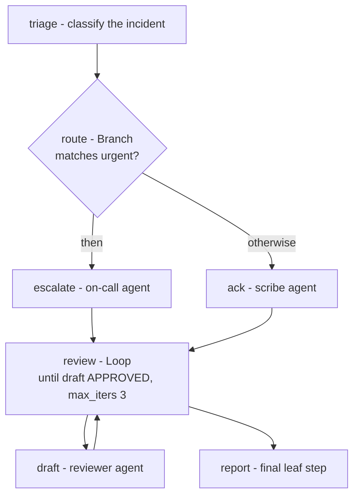

# The north-star in action

tau's [slicing policy](../explanation/slicing-policy.md) names one
cross-epic north star: a single executable demo fixture — an
`[allow]`-governed workflow using **Branch + Loop**, built to both the dev
and wasm targets, run in CI — that every new construct and target extends
instead of adding throwaway examples. This page walks that fixture as it
exists today: what it proves, how to run each leg, and which legs are
still blocked by open engine issues.

The fixture lives at `crates/tau-cli/tests/fixtures/north-star/tau.toml`,
its negative twin at
`crates/tau-cli/tests/fixtures/north-star-over-reach/tau.toml`, and every
claim below is enforced in CI by
`crates/tau-cli/tests/north_star_demo.rs` (plain `cargo nextest` tests —
no special harness).

## The scenario

An incident-triage workflow, small enough to read in one sitting but
exercising every governed-workflow surface at once:



## The constitution

Governance is declared once, at the root, and nothing in the project may
exceed it ([ADR-0057](../decisions/0057-root-allow-governance.md)):

```toml
[allow]
"fs.read" = { paths = ["/data/incidents/**"] }

[allow.models.default]
backend = "echo-llm"
model = "claude-haiku-4-5"

# Per-tool ceiling (kind-as-key): read_temp may never claim more than this.
[allow.tools.read_temp]
native = "ReadTemp"
"fs.read" = { paths = ["/data/incidents/**"] }
```

Three details worth noticing, because each one is checked at build time:

- **Model aliases move under `[allow.models]`.** A top-level `[models]`
  table coexisting with `[allow]` is rejected at parse — the constitution
  is the single home for the alias map.
- **Tools are registered AND bounded.** `[allow.tools.read_temp]` both
  registers the tool and gives it a capability ceiling. The tool's own
  declaration then *narrows* it:

  ```toml
  [tools.read_temp]
  native      = "ReadTemp"
  description = "Read the incident sensor temperature."
  capabilities = [{ kind = "fs.read", paths = ["/data/incidents/sensors/**"] }]
  ```

- **Agents inherit their grant from their package manifest.** The
  governance lattice checks tool caps ⊆ tool ceiling ⊆ root, and tool
  caps ⊆ the agent's effective grant (its package's declared
  capabilities, optionally narrowed per agent).

## Branch + Loop authoring

The pipeline uses both control-flow constructs end to end
([ADR-0058](../decisions/0058-ir-control-flow-blocks.md),
[ADR-0059](../decisions/0059-ir-control-flow-interpreter.md); Branch
syntax is documented in
[Author a conditional branch](../how-to/authoring-a-branch.md)):

```toml
# Branch: urgent incidents escalate; routine ones get acknowledged.
[[pipeline.steps]]
id = "route"
branch = { evaluates = "steps.triage.output", check = "matches", pattern = "(?i)urgent" }

  [[pipeline.steps.then]]
  id = "escalate"
  run = "agent:oncall"
  input = "${steps.triage.output}"

  [[pipeline.steps.otherwise]]
  id = "ack"
  run = "agent:scribe"
  input = "${steps.triage.output}"

# Bounded Loop: redraft until the reviewer approves, at most 3 times.
[[pipeline.steps]]
id = "review"
until = { evaluates = "steps.draft.output", check = "matches", pattern = "APPROVED" }
max_iters = 3

  [[pipeline.steps.body]]
  id = "draft"
  run = "agent:reviewer"
  input = "${steps.triage.output}"
```

A loop step is `until = { <condition> }` + a mandatory positive
`max_iters` + a nested `body` array. The `until` condition is evaluated
*after* each body pass; exhausting `max_iters` without it holding is a
hard runtime error, not a silent fall-through.

Scope rules the fixture leans on (and that `tau build` enforces):

- A nested step sees only the outer top-level scope plus its own prior
  siblings — `draft` may read `triage`, but not `escalate` (which lives
  inside the `route` subtree).
- A later top-level step may reference nested descendants of earlier
  top-level steps. The final `report` step reads **both**
  `${steps.escalate.output}` and `${steps.draft.output}`, and template
  resolution hard-errors on unresolved references — so a completed run
  *proves* the branch's then-arm and the loop body both executed.

## Running each leg

**Governance check (the positive gate).** The governed fixture is clean:

```text
$ tau check governance        # exit 0
```

**The negative twin.** `north-star-over-reach` is byte-identical except
`read_temp` claims `fs.read /etc/**` — outside the ceiling:

```text
$ tau check governance        # exit 2
tau.governance.over_reach: tool 'read_temp': capability fs.read "/etc/**"
  exceeds [allow] ceiling (not a subset of any allowed path)
```

The same violations refuse `tau build` — governance is a build-time gate,
not a runtime hope (see
[the three-gate guarantee](../explanation/three-gate-guarantee.md)).

**Artifact build.** `tau build` needs no flag — the `[allow]` section IS
the consent — and stamps the verdict into the bundle:

```text
$ tau build                   # prints <project>.tau; manifest records verdict "governed"
```

**Execution (dev and bundle).** The pipeline runs end to end via
`tau run triage "coolant alarm"` and via `tau build` +
`tau run --bundle`: the branch takes the then-arm, the loop converges
within its bound, and the final leaf step's output is rendered as the
run result.

**Wasm.** `tau build --target wasm-guest` now *builds* the workflow:
[ADR-0068](../decisions/0068-wasm-guest-control-flow.md) (#621) flipped
`any-wasi-strict` to execute Branch/Parallel/Loop in-guest via
`run_pipeline`, so this fixture's feature-fit gate passes and the build
proceeds to compile the wasm guest with the baked IR.

The refusal witness moved to a twin fixture,
`crates/tau-cli/tests/fixtures/north-star-suspend/tau.toml` — byte-identical
to this one plus one `suspend:human-signoff` step before `report`:

```text
$ tau build --target wasm-guest   # (north-star-suspend) exit 2
error: ... feature-fit ... unsupported by target any-wasi-strict: [Suspend]
```

This refusal is still part of the demo, not a caveat: the wasm guest has
no `SuspensionStore` channel, so a workflow that suspends is rejected
*before any artifact exists* — the same enforce-at-build-time principle
as governance. `Dynamic` regions (EPIC 4.5, pending) are refused the same
way.

## Known gaps (tracked, pinned by tests)

- [#623](https://github.com/tau-rs/tau/issues/623) — `tau run --bundle`
  ignores the positional agent argument and picks the
  alphabetically-first agent as entry; the fixture gives every agent the
  same config so entry order doesn't matter.

## What you just learned

One fixture now witnesses the whole pitch: a root constitution that
build-gates capability over-reach (positive and negative), Branch + Loop
authoring that survives lowering, canonical IR, a bundle roundtrip, and a
wasm target that now builds the same in-guest via `run_pipeline`
(ADR-0068) — with a Suspend twin still refused where the guest lacks a
durable channel, and every remaining gap pinned to an issue by a test
that flips when it is fixed. Extend *this* fixture when your epic lands a
new construct or target; don't add a throwaway one.
